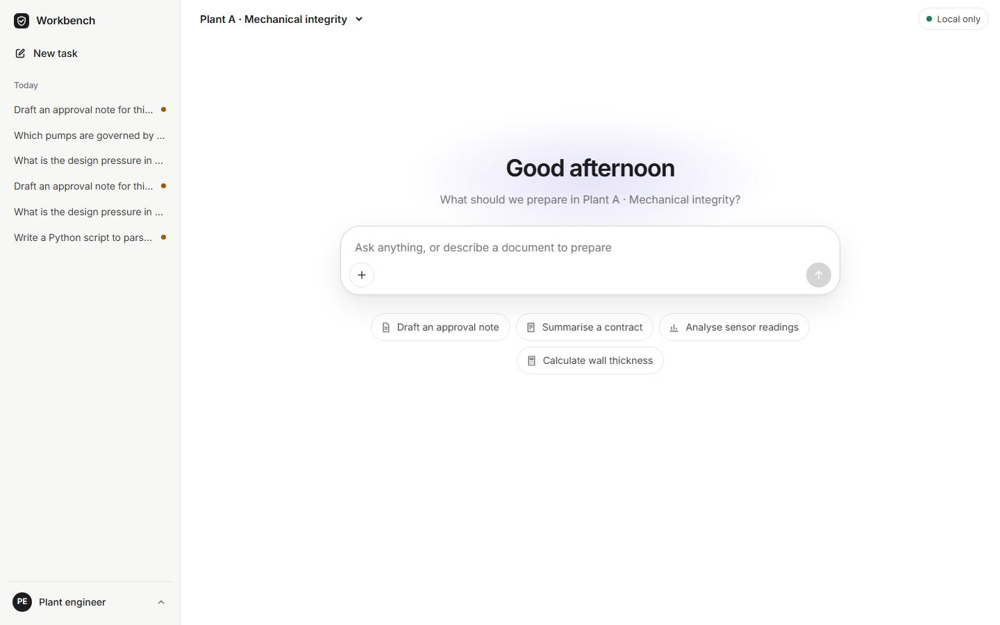
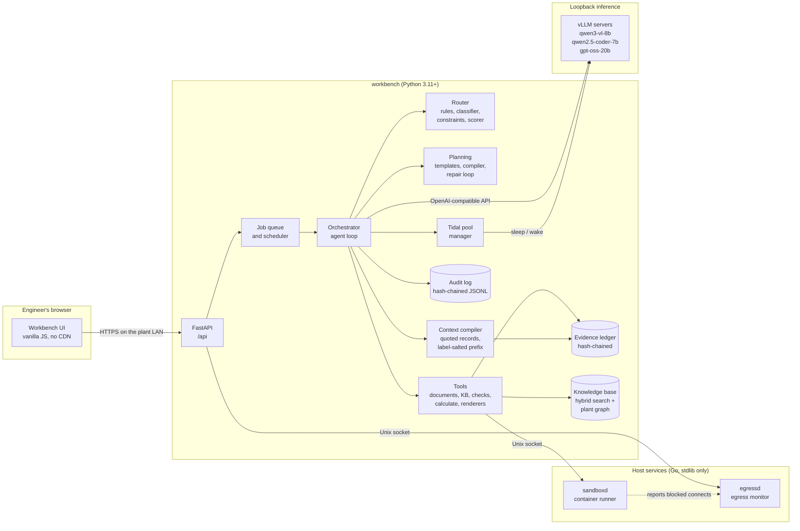
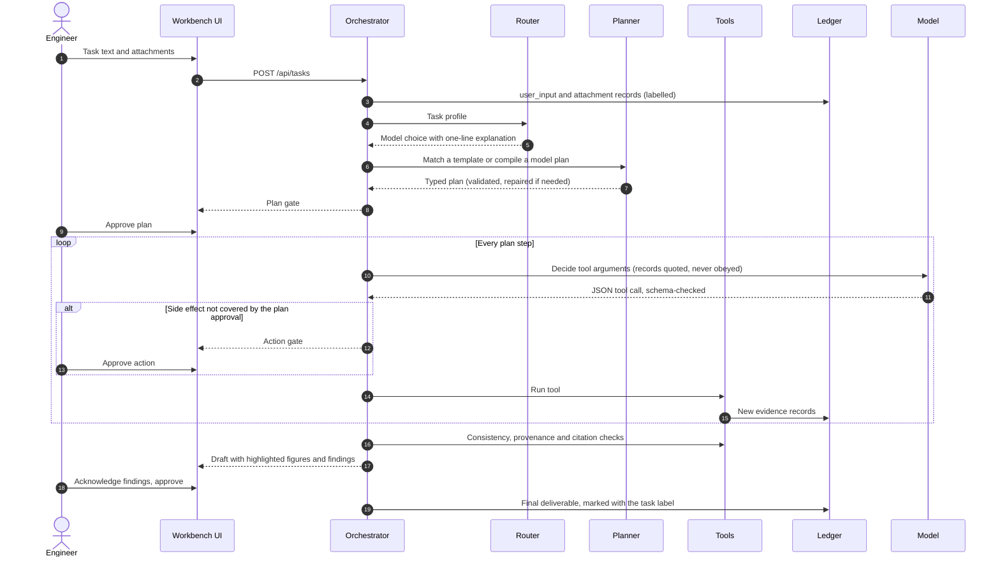
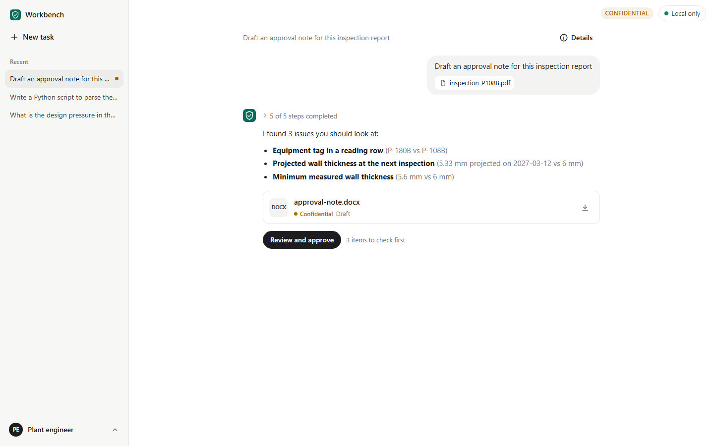
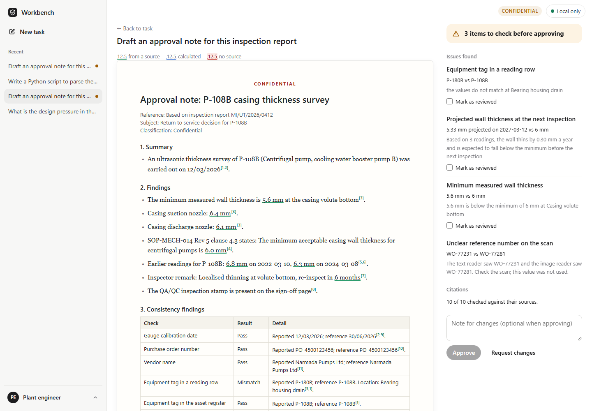
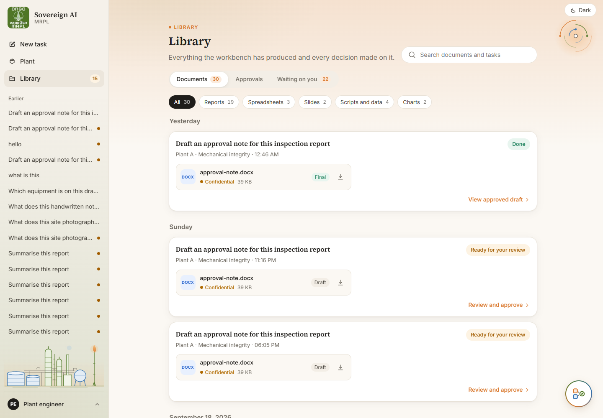
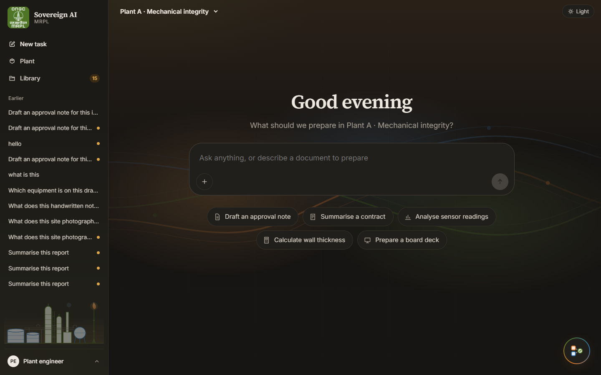
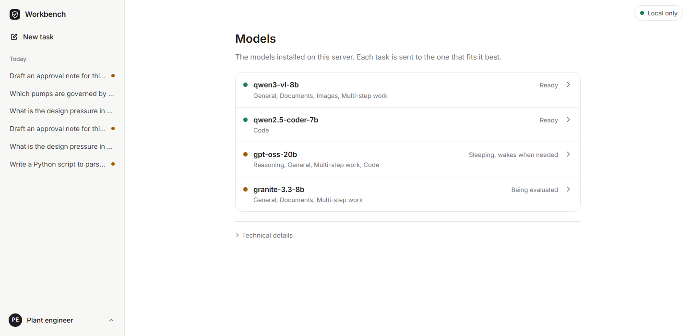
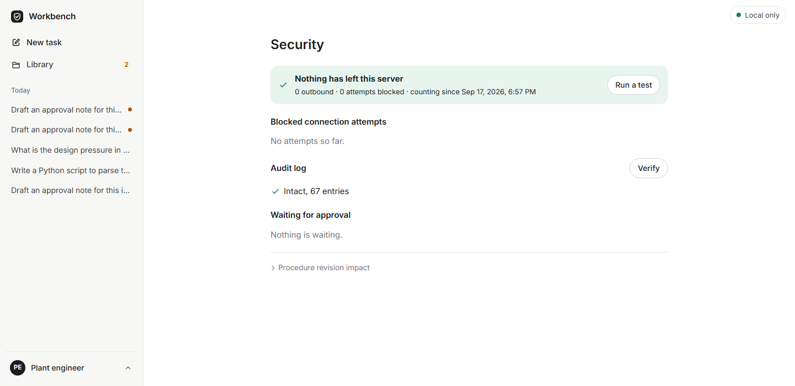

# Sovereign AI Workbench

**The agentic layer of an air-gapped engineering workbench.** Engineers drop in scanned inspection reports, contracts, vendor offers and data files, and the workbench plans the work, runs the tools, checks every figure against its source, and hands back a reviewable draft: an approval note, a verified script, a contract summary, a calculation sheet or an offer comparison. Nothing leaves the premises, and every number in a deliverable can be traced back to the page it came from.



This repository implements the **agentic layer** described in [`docs/design/SYSTEM_DESIGN.md`](docs/design/SYSTEM_DESIGN.md) section 4, following the build plan in [`docs/design/IMPLEMENTATION_PRD.md`](docs/design/IMPLEMENTATION_PRD.md). The inference servers (vLLM), the GPU and the network hardening are outside its scope; the layer talks to them through narrow, testable interfaces and ships deterministic stand-ins so the whole system runs and is tested on a laptop.

---

## Contents

- [What it does](#what-it-does)
- [Architecture](#architecture)
- [How a request flows](#how-a-request-flows)
- [Demo traces](#demo-traces)
- [Quick start](#quick-start)
- [Using the workbench](#using-the-workbench)
- [Command line](#command-line)
- [Configuration](#configuration)
- [Repository layout](#repository-layout)
- [Testing and quality](#testing-and-quality)
- [What is simulated](#what-is-simulated)
- [Documentation](#documentation)

---

## What it does

| Capability | How it works |
|---|---|
| **Plans before it acts** | A task is matched to a versioned YAML template, or a model writes a plan that a typed compiler validates and repairs. The engineer approves the plan before any tool runs. |
| **Chooses the model automatically** | Hard rules, a small classifier, capability constraints and a quality scorer pick one of the registered models. Every decision is logged as one readable line. |
| **Uses one GPU for several models** | A tidal pool keeps the everyday models resident and swaps the reasoning model in when a queue of work justifies it. |
| **Grounds everything in evidence** | Each extracted value, retrieved passage and computed figure becomes a hash-chained ledger record. Prompts cite records; deliverables cite records. |
| **Reads scans twice** | Critical fields are read by OCR and by a vision model independently, then reconciled. Disagreements are flagged, never guessed. |
| **Checks before it hands over** | Consistency rules, trend projection, number provenance and citation verification run on every draft. Approval stays locked until mismatches are acknowledged and unsourced figures are resolved. |
| **Runs code in a sandbox** | Generated scripts run in a network-less container managed by `sandboxd`, and the agent iterates on tracebacks. |
| **Enforces classification** | Every record and file carries a label. Tasks inherit the highest label they read, retrieval is filtered by clearance and need-to-know, and a downgrade needs two different authorised people. |
| **Proves it is sovereign** | `egressd` counts every outbound attempt from three independent sources, and the UI shows the live counters next to a one-click egress test. |

## Architecture



The Python application owns every control decision: labels, routing constraints, plan validation, consistency checks, number provenance and approvals are deterministic code. Models only propose. The two Go daemons are the only components that touch the container runtime and the firewall counters, and they listen on Unix sockets (loopback TCP with a token file on Windows development machines).

A deeper walk-through with more diagrams is in [`docs/ARCHITECTURE.md`](docs/ARCHITECTURE.md).

## How a request flows



## Demo traces

The five scenarios from the design run end to end with `workbench demo`. The table below is the actual output on a Windows laptop with the offline backend (times in seconds).

| Trace | Task | Route | Model | Plan | Checks | Label | Time |
|---|---|---|---|---|---|---|---|
| **A** | Draft an approval note from a scanned inspection report | document | qwen3-vl-8b | template `approval_note_from_scan` | 3 mismatches caught, 0 unsourced figures | Confidential | 1.26 |
| **B** | Write a script to parse pressure readings and flag anomalies | code | qwen2.5-coder-7b | compiled, 0 repairs | 2 sandbox runs (first fails with `KeyError`, fix passes) | Restricted | 0.58 |
| **C** | Summarise a 40-page vendor contract | document | qwen3-vl-8b | template `contract_summary` | map and reduce with clause citations | Confidential | 1.36 |
| **D** | Compute required pipe wall thickness | general | qwen3-vl-8b | template `calc_sheet` | units checked by `calculate` | Restricted | 0.48 |
| **E** | Compare three vendor offers and recommend one | agentic | gpt-oss-20b | compiled, 1 repair | scoring run in the sandbox | Secret, VENDOR-COMMERCIAL | 1.45 |

In every run the egress test passed and the external connection counter stayed at zero.

A task reads like a conversation: the request, the plan to approve, the steps as they finish, the issues found and the files produced.



The review screen shows the draft as paper and underlines every figure by where it came from (a source, a calculation, or no source). The issues must be marked as reviewed before **Approve** unlocks, and each citation is checked against the record it cites.



## Quick start

**Requirements:** Python 3.11 or newer. Go 1.22 or newer is only needed to build the host daemons. Docker is only needed for the production sandbox backend.

### 1. Install

```bash
git clone https://github.com/Rishi0507/Sovereign-AI-Workbench.git
cd Sovereign-AI-Workbench
python -m venv .venv
```

```bash
# Linux / macOS
source .venv/bin/activate
# Windows (PowerShell)
.venv\Scripts\Activate.ps1
```

```bash
pip install -e ".[dev]"
cp .env.example .env         # Windows: copy .env.example .env
```

### 2. Choose how host services run

The workbench expects the `sandboxd` and `egressd` daemons. For a first look you can use the in-process stand-ins instead by editing `.env`:

```ini
WB_SANDBOX=fake
WB_EGRESS=fake
```

To run the real daemons locally (they use a subprocess backend without Docker in development):

```bash
python scripts/dev.py go-build
workbench render-go-config --backend dev --mode dev
bin/sandboxd -config var/go-config/sandboxd.json &
bin/egressd  -config var/go-config/egressd.json &
```

### 3. Generate fixtures, seed and serve

```bash
python scripts/dev.py fixtures   # synthetic reports, contract, offers, KB, asset register; then `workbench setup`
workbench serve                   # http://127.0.0.1:8080
```

Open <http://127.0.0.1:8080> and click **Draft an approval note**. The request and the matching scanned report are filled in; press Enter, then **Start** on the plan.

### 4. Run everything headless

```bash
workbench demo                   # Traces A to E with automatic approvals
workbench eval                   # writes reports/eval.md and reports/eval.json
```

`make` targets (`make setup`, `make test`, `make demo`, ...) are thin wrappers around `python scripts/dev.py <task>`, so the same commands work on Windows without `make`.

## Using the workbench

The interface is deliberately plain: a sidebar with your recent tasks, one box to type in, and a conversation for each task.

| Screen | What you do there |
|---|---|
| **Home** | Type a request, attach files with the paperclip (or upload new ones), or pick a suggestion. |
| **Library** | Every generated file grouped by task and day, every decision in a timeline, and everything waiting on you. Search across all of it and filter documents by type. |
| **Task** | A conversation: approve, edit or cancel the plan, follow progress, read answers with numbered sources, see counted facts such as page and word totals, download files, and keep asking follow-ups in the box at the bottom. **Details** opens the technical record: activity log, evidence, model choice and checks. |
| **Review** | Read the draft, click any figure or source number to see where it came from, mark issues as reviewed, fix figures without a source, then approve or request changes. |
| **Models** | See which models are ready, asleep or being evaluated, and how well each does per kind of work. |
| **Security** | See that nothing has left the server, run a network test, check the audit log and handle approval requests. |

The account menu (bottom left) switches the signed-in user in development and links to Models and Security. The top bar shows the classification of the open task and the network status. The interface follows the system light or dark theme, works on phone screens, and animates every change (tabs slide, panels glide, lists update in place) so nothing jumps.





<p align="center"> </p>

## Command line

| Command | Purpose |
|---|---|
| `workbench setup [--reset]` | Create runtime folders, seed the demo workspaces and reference data, ingest the knowledge base. |
| `workbench serve [--host --port]` | Start the API and the UI (loopback by default). |
| `workbench run "<text>" --attach inputs/x.pdf [--auto-approve]` | Run one task headless and print its trace. |
| `workbench demo [--runs N]` | Run Traces A to E and print the summary table. |
| `workbench eval [--write-registry] [--refresh]` | Run the evaluation set; optionally propose new quality values for `config/models.yaml`. |
| `workbench ingest <dir>` | Ingest markdown documents into the knowledge base and the plant graph. |
| `workbench kb stats` / `workbench kb impact <doc> <rev>` | Knowledge-base statistics and the supersession impact report. |
| `workbench registry render-serve --profile S` | Write the `vllm serve` commands for a hardware profile. |
| `workbench registry shadow <model>` / `promote <model>` | Evaluate a shadow model offline and promote it with one audited change. |
| `workbench audit verify` / `audit summary <date>` | Verify the audit hash chain and print a daily summary. |
| `workbench render-go-config` | Render the daemon JSON configuration from the YAML settings. |
| `workbench manifest-verify <manifest> <dir>` | Verify a SHA-256 manifest (supply-chain check for model weights). |

## Configuration

All configuration lives in plain files under [`config/`](config), and every top-level setting can be overridden with an environment variable `WB_<KEY>` or a local `.env` file (never committed).

| File | Contents |
|---|---|
| `config/settings.yaml` | Backend, host services, storage paths, agent limits, check tolerances, step budgets. |
| `config/models.yaml` | Model registry: capabilities, context, protocol, quality table, `serve` parameters per profile. |
| `config/pool.yaml` | Tidal pool: the swap-slot model, maximum wait, queue size that turns the tide, minimum residency. |
| `config/labels.yaml` | Classification levels, compartments, downgrade roles. |
| `config/users.yaml`, `config/workspaces.yaml` | Development directory: users, groups, clearances, workspace ceilings. |
| `config/egress_allowlist.yaml` | Loopback and LAN destinations that are allowed. |
| `templates/*.yaml` | Versioned plan templates. |
| `rules/consistency/*.yaml` | Consistency rules applied to every deliverable. |
| `schemas/*.json` | JSON Schemas for every structured model output. |

The workbench needs no API keys. To use real models, start vLLM on loopback with the commands from `workbench registry render-serve` and set `WB_LLM_BACKEND=openai`.

## Repository layout

```text
workbench/            Python package (the agentic layer)
  agent/              orchestrator, approval gates, code protocol, delegation
  router/             rules, classifier, constraints, scorer, explanation
  planning/           templates, typed plan compiler, repair, promotion
  context/            context compiler and label-salted cache keys
  tools/              tool registry and every tool implementation
  documents/          readers, OCR sidecars, dual-read reconciliation
  kb/                 chunking, embeddings, BM25, fusion, revisions, plant graph
  checks/             consistency engine, trend, provenance, citations
  core/               ledger, labels and policy, audit, database, normalisation
  llm/                backends (heuristic, scripted, OpenAI-compatible) and prompts
  pool/ registry/     tidal pool manager, model registry and shadow evaluation
  security/           egress guard, daemon clients, transport, manifests
  eval/               datasets, metrics, report writer
  api/ ui/            FastAPI routes and the web interface
go/                   sandboxd and egressd (standard library only)
config/ templates/ rules/ schemas/
fixtures/             evaluation sets, scripted model outputs
scripts/              fixture generator and cross-platform dev tasks
deploy/               systemd units, nftables, sinkhole, Docker and vLLM files
tests/                unit, integration, acceptance and contract tests
docs/                 architecture, API, security, deployment, decisions, design
```

## Testing and quality

```bash
python scripts/dev.py test            # pytest: unit, integration, acceptance, contract (fakes)
python scripts/dev.py lint            # ruff and strict mypy on the core packages
python scripts/dev.py go-test         # Go unit tests with coverage
python scripts/dev.py go-lint         # gofmt, go vet, no third-party modules
python scripts/dev.py go-integration  # builds both daemons and runs the contract tests against them
python -m pytest tests/ui             # optional: drives the interface in Chrome (needs Playwright)
```

- Tests run with network access blocked (`pytest-socket`); only loopback is allowed.
- Contract tests run the same assertions against the in-process fakes and, with `WB_GO_BINARIES=1`, against the real daemons.
- The routing evaluation (50 prompts) scores 100%, and the router's tricky cases are covered by unit tests.
- Go coverage: `sandbox` 92%, `egress` 93%, `pathjail` 86%.
- A hygiene test keeps the repository free of em dashes and checks that the UI script parses.

See [`docs/DEVELOPMENT.md`](docs/DEVELOPMENT.md) for the full workflow.

## What is simulated

The layer is complete, but a laptop has no GPU, no container runtime and no firewall. These parts are stand-ins, and each is clearly marked in the code and the UI:

| Stand-in | Replaces | Where |
|---|---|---|
| `HeuristicBackend` | The LLM and VLM calls. It is deterministic, reads only the records it is given, and deliberately fails the first Trace E plan and the first Trace B script so the repair paths run. | `workbench/llm/heuristic.py` |
| OCR sidecars (`*.ocr.json`) | PaddleOCR output for scanned fixtures. Text PDFs are read for real with PyMuPDF. | `workbench/documents/readers.py` |
| `FakeSandbox`, `FakeEgressd` | The Go daemons, when `WB_SANDBOX=fake` / `WB_EGRESS=fake`. | `workbench/tools/sandbox.py`, `workbench/security/egressd_client.py` |
| `dev` sandbox backend | Docker. Scripts run as a subprocess with a network probe; isolation is only real with the `docker` backend. | `go/internal/sandbox/dev.go` |
| Seed quality values | Measured model quality. The values in `config/models.yaml` are illustrative until `workbench eval --write-registry` runs on real models. | `config/models.yaml` |
| Development sign-in | The directory adapter. The user switcher sets an `X-User` header or cookie. | `workbench/api/deps.py` |

Everything else (routing, planning, the ledger, labels, checks, rendering, retrieval, the audit chain, the daemons' protocols) is the production code path.

## Documentation

| Document | Contents |
|---|---|
| [`docs/ARCHITECTURE.md`](docs/ARCHITECTURE.md) | Components, the agent loop, routing, evidence, checks, retrieval and the tidal pool, with diagrams. |
| [`docs/API.md`](docs/API.md) | Every HTTP endpoint of the workbench and of the two daemons. |
| [`docs/SECURITY.md`](docs/SECURITY.md) | Classification, need-to-know, prompt-injection containment, egress enforcement and proof. |
| [`docs/DEPLOYMENT.md`](docs/DEPLOYMENT.md) | Installing on the air-gapped server: services, firewall, sandbox image, models. |
| [`docs/DEVELOPMENT.md`](docs/DEVELOPMENT.md) | Local setup, test layers, fixtures, evaluation, adding tools, templates and models. |
| [`docs/DECISIONS.md`](docs/DECISIONS.md) | Every place where the implementation deviates from or refines the PRD, and why. |
| [`docs/design/`](docs/design) | The system design, the diagrams and the implementation PRD this code follows. |
