# Architecture

This document explains how the agentic layer is put together: the components, how a task moves through them, and the rules that keep the system grounded, classified and sovereign. Section numbers such as "design 4.2" refer to [`design/SYSTEM_DESIGN.md`](design/SYSTEM_DESIGN.md).

## Contents

1. [Principles](#1-principles)
2. [Component map](#2-component-map)
3. [Task lifecycle](#3-task-lifecycle)
4. [The agent loop](#4-the-agent-loop)
5. [Routing](#5-routing)
6. [Planning](#6-planning)
7. [Evidence ledger and context compilation](#7-evidence-ledger-and-context-compilation)
8. [Documents and dual reads](#8-documents-and-dual-reads)
9. [Knowledge base and plant graph](#9-knowledge-base-and-plant-graph)
10. [Deliverables and checks](#10-deliverables-and-checks)
11. [Tidal pool](#11-tidal-pool)
12. [Host services](#12-host-services)
13. [Persistence](#13-persistence)

---

## 1. Principles

| Principle | Consequence in the code |
|---|---|
| **Models propose, code decides.** | Labels, routing constraints, plan validation, consistency checks, number provenance and approvals are deterministic Python. A model output is only accepted after it passes a JSON Schema and a semantic check. |
| **Everything is evidence.** | Tools never hand raw text to the next step. They write ledger records with an id, a label, a confidence and an anchor, and later steps refer to those ids. |
| **Data is quoted, never obeyed.** | Document text reaches a model only inside `<record>` blocks, after the instructions, and the system prompt says such content is data. |
| **Humans hold the pen.** | Plans, side-effecting actions and deliverables pass through gates. Approval of a draft is impossible while checks are open. |
| **Fail visibly.** | Invalid output is retried, then the template default runs, then the task escalates or is handed back. Every step appears in the trace with its reason. |
| **Same code path everywhere.** | The offline backend and the fake host services implement the same interfaces as vLLM and the Go daemons, and contract tests hold both sides to the same assertions. |

## 2. Component map

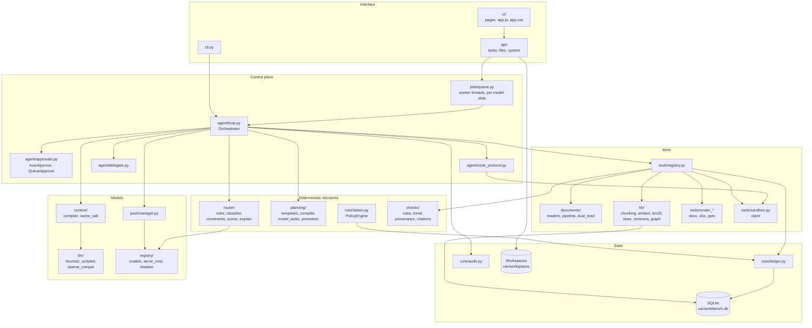

`workbench/runtime.py` builds one `Runtime` that wires these parts together from `config/`. Tests build their own runtimes with a fixed clock, a temporary root and whichever backend or host-service fakes they need.

## 3. Task lifecycle

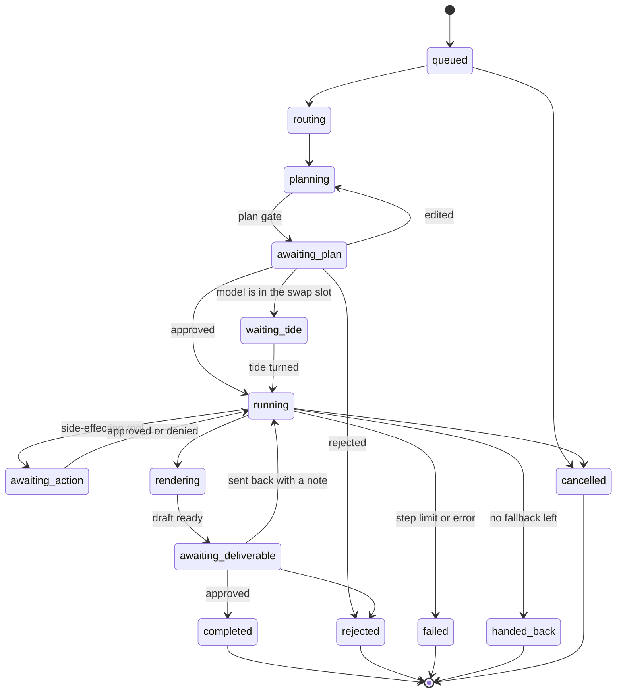

Every transition is written to the task state (SQLite), to the live trace shown in the UI and, for the important ones, to the audit log. Gates are persisted too: the UI reads the pending gate from the task and posts a decision to the matching endpoint.

## 4. The agent loop

`Orchestrator.run` (in `agent/loop.py`) executes the design's pseudocode (design 4.1) in four phases: route, plan, execute, deliver.

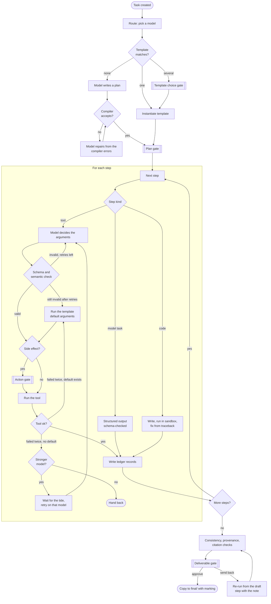

**Budgets.** `max_steps` caps the number of model calls per task, `max_retries` caps retries per decision, `max_code_iters` caps sandbox iterations and `max_repairs` caps plan repairs (all in `config/settings.yaml`).

**Code protocol.** A code step must answer with exactly one fenced Python block. The block is written to the job folder, run by the sandbox, and the result (exit code, tails, traceback head, new files) comes back as a `sandbox_result` record. The next attempt sees only the traceback and the previous script.

**Delegation.** A step may delegate a sub-question to a child task. The child inherits the parent's label as a floor, so a child can never produce something less classified than what the parent already read.

**Revisions.** When a reviewer sends a draft back, the note becomes a `user_input` record and the loop re-runs from the drafting step, keeping the evidence it already has.

**When a gate is skipped.** Two settings shorten the path without removing control. With `auto_start_read_only`, a plan that has no side effects and produces no file (a question) starts at once; its plan gate is recorded as decided by `system`. With `plan_approval_covers_drafts`, the person who approves a plan also approves its file-creating steps on the first pass, recorded as "approved with the plan"; a revision overwrites files and therefore asks again. The deliverable review is never skipped.

**Incomplete drafts.** If the drafting model still produces an invalid note after its retries, the renderer writes a skeleton with an explicit "incomplete" list instead of inventing content.

## 5. Routing

```mermaid
flowchart LR
    IN[Task text,<br/>attachments,<br/>workspace] --> R1

    subgraph R1["Stage 1: rules"]
        direction TB
        A1[Code file, traceback<br/>or explicit code request] --> CODE[route code]
        A2[Several files or<br/>several deliverables] --> AG[route agentic]
        A3[Single PDF] --> DOC[route document]
        A4[Single image] --> VIS[route vision]
    end

    R1 -- no rule --> C1["Classifier<br/>small model, JSON profile"]
    R1 --> P[Task profile]
    C1 --> P

    P --> S2

    subgraph S2["Stage 2: constraints"]
        direction TB
        B1[status active]
        B2[modality supported]
        B3[context fits]
        B4[tool protocol]
        B5[route allowed]
        B6[provenance policy]
        B7[pool can serve it]
    end

    S2 --> S3["Stage 3: score<br/>cheapest model whose quality<br/>meets the complexity threshold"]
    S3 --> OUT["Decision + one-line log<br/>+ JSON for the UI"]
```

A decision line looks like this:

```text
2026-09-17T04:10:23Z task=T40984344 profile={type=general mod=[text] tok≈4k lang=[en] cx=medium conf=0.75}
  candidates: qwen3-vl-8b q=0.84 cost=2.9s ✓ | gpt-oss-20b q=0.86 cost=3.5s+tide 110s ✓ | qwen2.5-coder-7b ✗ tools | granite-3.3-8b ✗ status
  threshold=0.80 → qwen3-vl-8b
```

- **Cost** is the model's step latency plus the expected wait for the tide when the model is asleep.
- **Low classifier confidence** raises the threshold by one level.
- **No candidate above the threshold:** the highest-quality candidate is chosen and the decision is marked `below_threshold`.
- **Adding a model** takes a registry entry, a `serve` block and a shadow evaluation. `workbench registry promote` then flips the entry to active with one audited change.

## 6. Planning

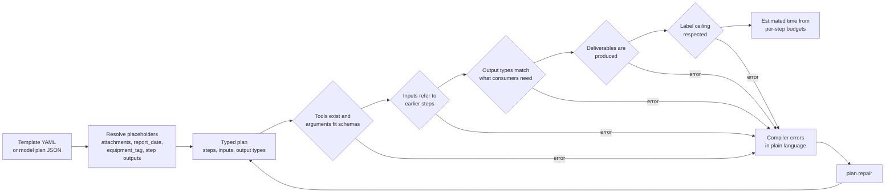

- **Templates** (`templates/*.yaml`) are versioned. A template matches on route, attachment types and intent keywords.
- **Placeholders** are resolved at run time. `script` and `content` arguments are kept verbatim, so code keeps its whitespace.
- **Promotion.** A successful untemplated plan can be saved as a template draft from the task page. An admin or document owner approves it on the Security page.
- **Errors** name the step and the problem, for example `step 3: input "tables" is not produced by any earlier step`, which is exactly what the repair prompt needs.

## 7. Evidence ledger and context compilation

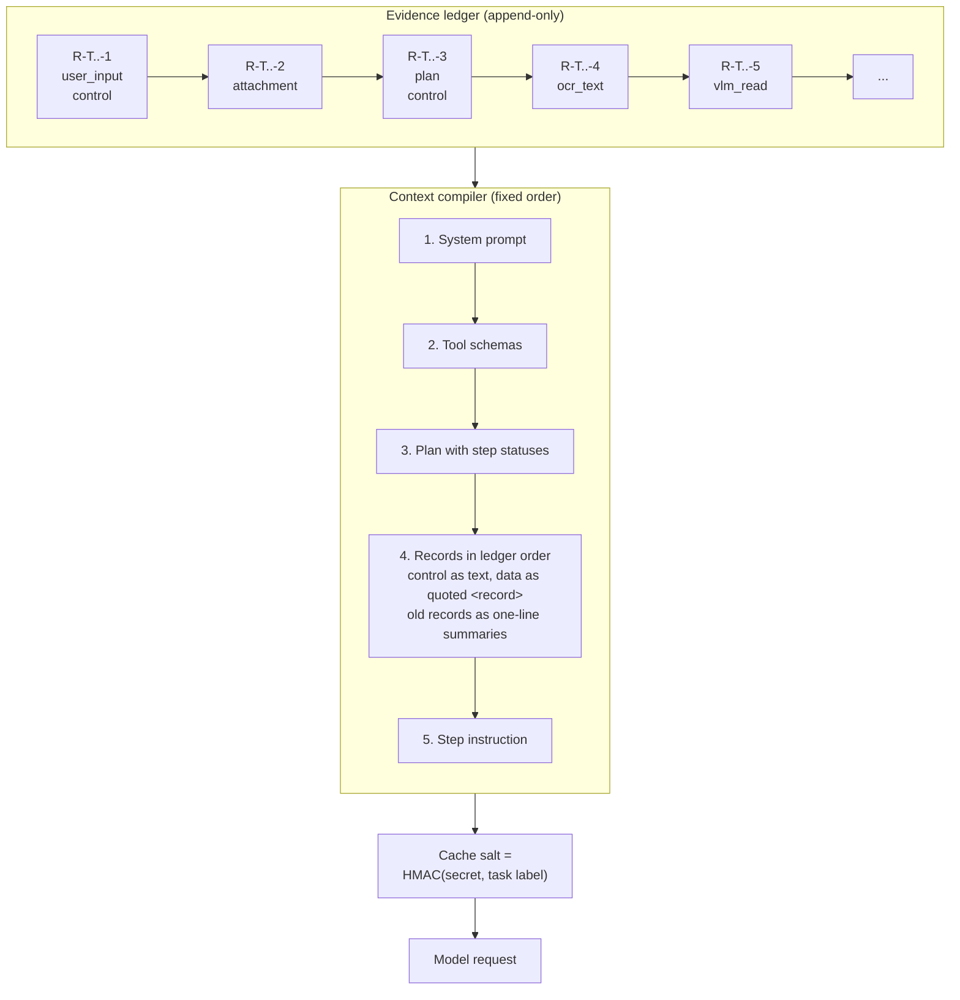

Each record carries:

| Field | Meaning |
|---|---|
| `id`, `seq`, `hash`, `prev_hash` | Identity and the hash chain (`R-<task>-<n>`). |
| `kind` | `user_input`, `plan`, `attachment`, `ocr_text`, `vlm_read`, `kb_chunk`, `graph_fact`, `sandbox_result`, `calc_result`, `check_result`, `model_output`, `tool_output`. |
| `trust` | `control` for the user's request and the approved plan; `data` for everything else. |
| `label` | Classification and compartments. |
| `anchor` | Document, revision, page and region, used for crops and citations. |
| `fields` | Typed values (quantity with unit, date, tag, party, PO, clause) with normalised forms. |
| `confidence` | `high`, `medium`, `low` or `uncertain`. |

**Cache salting.** The label-salted prefix means two tasks with different labels never share a KV-cache prefix (design 3.0.3). The evaluation confirms zero cache hits across label partitions. `CacheSimulator` models hit rates when running offline.

**Summaries.** Older records collapse to one-line summaries that change only at step boundaries, so the prompt prefix stays stable within a step. The model can pull a full record back with the `recall` tool.

## 8. Documents and dual reads

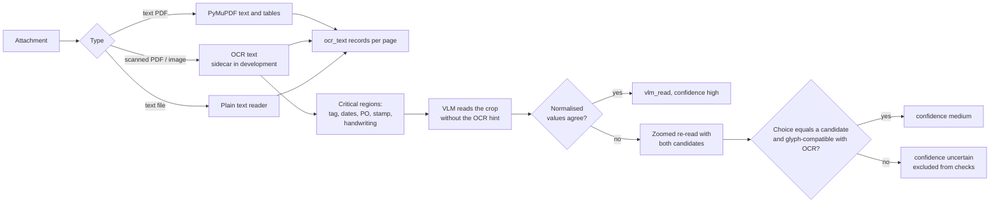

Classification markings found in page text (in English and Hindi) raise the attachment label. Uncertain reads are shown on the review page as "not checked" findings, never silently used.

## 9. Knowledge base and plant graph

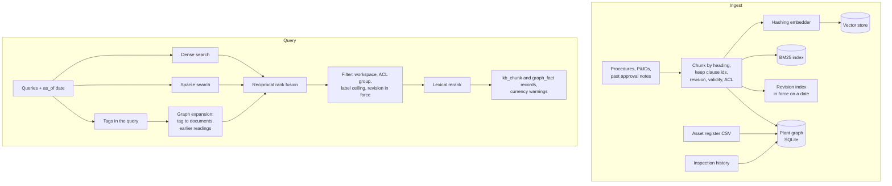

The graph holds tags, equipment classes, documents, clauses, vendors, purchase orders and inspections. Edges carry validity dates, so "as of" queries walk only edges that were valid then. `graph_lookup` answers structural questions in both directions: the neighbours of a tag, or the equipment a document governs through its equipment classes.

When a new revision of a procedure arrives, `workbench kb impact <doc> <rev>` lists the changed clauses and limits, the past notes that cite them and the equipment they govern.

## 10. Deliverables and checks

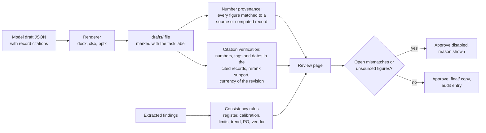

- **Consistency rules** are YAML (`rules/consistency/`) and support lookups, aggregates, fuzzy matches and a least-squares trend projected to the next inspection date.
- **Provenance** normalises units (via pint) before comparing, within `number_tolerance`. The reviewer can correct a figure, link it to a record or confirm it, and each action is audited.
- **Spreadsheets** keep live formulas. Computed cells count as derived figures.

## 11. Tidal pool

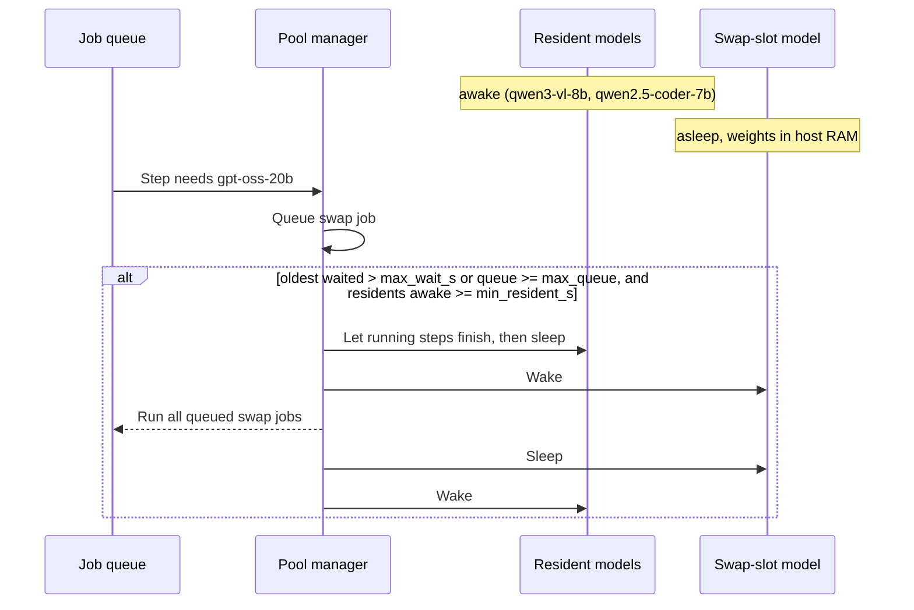

The router adds the expected wait to a sleeping model's cost, which is why simple work stays on resident models. `HttpVLLMControl` calls vLLM's sleep and wake endpoints (development mode); `FakeVLLMControl` simulates wake times scaled by `time_scale`.

## 12. Host services

Both daemons are written in Go with the standard library only, have no third-party modules, and share `internal/udsserver` for transport, request ids, access logs and error bodies.

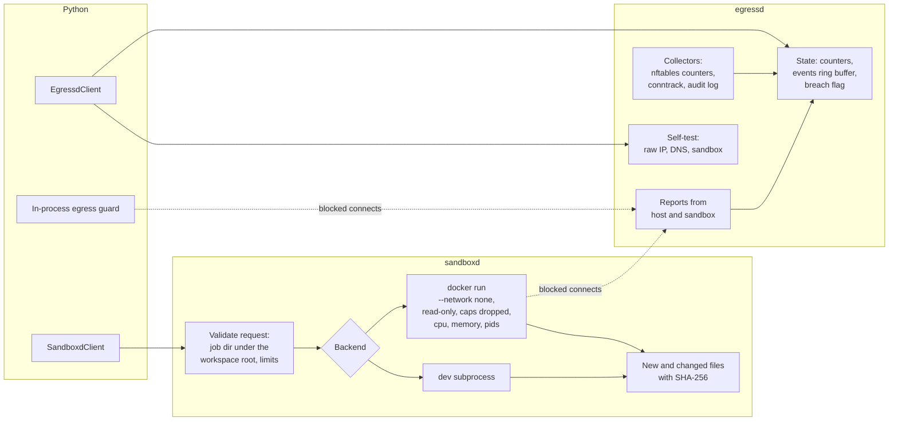

In **enforced** mode `egressd` refuses to start unless the nftables table exists with an output chain whose policy is drop and no upstream nameserver is configured. Any counted external connection sets the breach flag, which the UI shows in red.

## 13. Persistence

| Store | Contents |
|---|---|
| `var/workbench.db` (SQLite, SQLAlchemy Core) | Ledger records, task states, gates, files and labels, downgrade requests, plant graph, model outcomes. |
| `var/audit.jsonl` | Hash-chained audit log; `workbench audit verify` recomputes the chain. |
| `var/workspaces/<ws>/inputs`, `drafts/<task>`, `final/<task>` | Files. Drafts and final files sit in a folder per task. Each file's label is stored in a `.label.json` sidecar and in the database. |
| `var/workspaces/_jobs/<task>/` | Sandbox job folders: the script, its inputs and whatever it wrote. |
| `var/evidence/<task>/` | Crops of critical fields for the review page. |
| `var/kb/` | Chunks (JSONL) and the vector store. |
| `var/secret.key` | HMAC key for cache salts, created on first run with owner-only permissions. |
| `run/` | Daemon sockets (or address and token files on Windows) and daemon state. |

All of `var/`, `run/`, `bin/` and `reports/` are generated and ignored by git.
