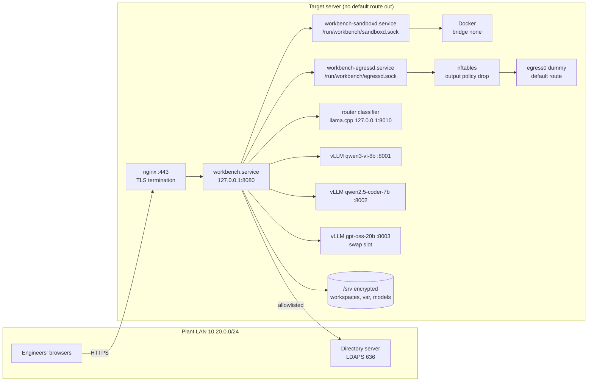
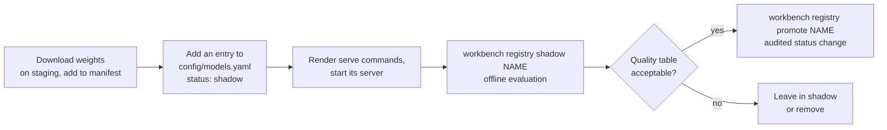

# Deployment

This guide installs the workbench on a single air-gapped server (hardware Profile S: one 24 GB GPU). Everything is prepared on an internet-connected **staging machine**, carried across as a signed bundle, verified, and installed on the **target server**, which never gets a route to the internet. Design references point to [`design/SYSTEM_DESIGN.md`](design/SYSTEM_DESIGN.md) section 7.

> The files in `deploy/` are reference artifacts. Nothing in the application applies them automatically; an administrator reviews and applies each one.

## Contents

1. [Topology](#1-topology)
2. [Hardware profiles](#2-hardware-profiles)
3. [Prepare the bundle (staging)](#3-prepare-the-bundle-staging)
4. [Harden the target server](#4-harden-the-target-server)
5. [Install](#5-install)
6. [Start the services](#6-start-the-services)
7. [Verify](#7-verify)
8. [Operate](#8-operate)
9. [Upgrade and add models](#9-upgrade-and-add-models)

---

## 1. Topology



| Service | Runs as | Listens on |
|---|---|---|
| `workbench.service` | `wb-app` (group `workbench`) | `127.0.0.1:8080` |
| `workbench-sandboxd.service` | `wb-app` with the extra group `docker`, granted to this process only | `/run/workbench/sandboxd.sock` |
| `workbench-egressd.service` | `wb-egress` (groups `adm`, `workbench`, `CAP_NET_ADMIN`) | `/run/workbench/egressd.sock` |
| vLLM servers (compose) | container | `127.0.0.1:8001-8003` |
| Router classifier (compose) | container | `127.0.0.1:8010` |
| nginx (compose) | container, host network | `:443` |

## 2. Hardware profiles

| Profile | GPU memory | Residents | Swap slot | KV cache |
|---|---|---|---|---|
| **S** | 24 GB | qwen3-vl-8b, qwen2.5-coder-7b | gpt-oss-20b (sleeps in host RAM) | FP8 |
| **M** | 48 GB | all three | none | FP8 |
| **L** | 80 GB class | all three, longer contexts | none | FP8 |

The profile is `profile` in `config/settings.yaml` (or `WB_PROFILE`). `workbench registry render-serve --profile <P>` writes the matching `vllm serve` commands to `deploy/vllm_commands.sh`, including memory fractions, context lengths, tool parsers and speculative decoding settings from `config/models.yaml`.

## 3. Prepare the bundle (staging)

```bash
# 1. Source and Python wheels
git clone https://github.com/Rishi0507/Sovereign-AI-Workbench.git workbench
cd workbench
pip wheel -w bundle/wheels .                       # the workbench wheel and every runtime dependency

# 2. Go daemons (static, no cgo, no third-party modules)
python scripts/dev.py go-build                     # writes bin/sandboxd and bin/egressd

# 3. Sandbox image, model servers, proxy
docker build -t workbench-sandbox:py311 -f deploy/sandbox.Dockerfile deploy
docker pull vllm/vllm-openai:<version>  nginx:<version>  <llama.cpp server image>
docker save -o bundle/images.tar workbench-sandbox:py311 vllm/vllm-openai:<version> nginx:<version> <llama.cpp image>

# 4. Model weights
huggingface-cli download Qwen/Qwen3-VL-8B-Instruct-AWQ        --local-dir bundle/models/Qwen/Qwen3-VL-8B-Instruct-AWQ
huggingface-cli download Qwen/Qwen2.5-Coder-7B-Instruct-AWQ   --local-dir bundle/models/Qwen/Qwen2.5-Coder-7B-Instruct-AWQ
huggingface-cli download openai/gpt-oss-20b                   --local-dir bundle/models/openai/gpt-oss-20b
# plus the GGUF router classifier (qwen2.5-1.5b-instruct-q4_k_m.gguf)

# 5. Manifest and signature
(cd bundle && find . -type f ! -name MANIFEST.sha256 -exec sha256sum {} + > MANIFEST.sha256)
gpg --detach-sign bundle/MANIFEST.sha256
```

Record the image digests (`docker inspect --format '{{index .RepoDigests 0}}'`) and put them in place of `REPLACE_WITH_DIGEST` in `deploy/compose.yaml`.

## 4. Harden the target server

Apply these before any workbench file arrives, and keep a console session open while changing the firewall.

1. **Firewall.** Edit the LAN, directory server and log host addresses in `deploy/nftables.conf`, then:

   ```bash
   install -m 0644 deploy/nftables.conf /etc/nftables.conf
   systemctl enable --now nftables
   nft list table inet sovereign
   ```

2. **Sinkhole route and no DNS.** Review and run `deploy/sinkhole.sh` as root. It moves the default routes to a dummy interface, disables `systemd-resolved`, empties `/etc/resolv.conf` and adds an `auditd` rule that records every `connect()`. Put internal names in `/etc/hosts`.

3. **Docker without networking.**

   ```bash
   install -m 0644 deploy/docker-daemon.json /etc/docker/daemon.json
   systemctl restart docker
   ```

4. **Disk encryption.** `/srv` must be on an encrypted volume (LUKS) unlocked at boot by the site's key procedure.

5. **Users and groups.**

   ```bash
   groupadd --system workbench
   useradd --system --home /srv/workbench --shell /usr/sbin/nologin -g workbench wb-app
   useradd --system --shell /usr/sbin/nologin wb-egress
   ```

   `sandboxd` runs as `wb-app` because it only accepts job folders owned by its own user, and the application creates those folders. The `docker` group is added to the `sandboxd` unit alone, so the web application process never holds it.

## 5. Install

```bash
# Verify the bundle before anything else
gpg --verify MANIFEST.sha256.sig MANIFEST.sha256
sha256sum -c MANIFEST.sha256

# Code and runtime
mkdir -p /srv/workbench /srv/workspaces /srv/models
cp -r workbench/. /srv/workbench/
python3.11 -m venv /srv/workbench/.venv
/srv/workbench/.venv/bin/pip install --no-index --find-links bundle/wheels sovereign-workbench
cp -r bundle/models/. /srv/models/
docker load -i bundle/images.tar

# Daemon binaries and configuration
install -m 0755 bin/sandboxd bin/egressd /srv/workbench/bin/
#   config/go/*.json already hold the production values (sockets in /run/workbench,
#   workspace root /srv/workspaces, backend auto, egressd mode enforced). Edit lan_cidrs and the
#   allowlist to match config/egress_allowlist.yaml, or regenerate both from the YAML:
/srv/workbench/.venv/bin/workbench render-go-config --out /srv/workbench/config/go \
    --run-dir /run/workbench --workspace-root /srv/workspaces --backend docker --mode enforced

# Directory, workspaces and labels
$EDITOR /srv/workbench/config/workspaces.yaml /srv/workbench/config/labels.yaml
cp /srv/workbench/.env.example /srv/workbench/.env      # optional overrides, never committed

# Ownership
install -d -o wb-app -g workbench -m 0770 /srv/workbench/var /srv/workbench/reports /srv/workbench/templates/drafts
chown -R wb-app:workbench /srv/workspaces
chmod 0770 /srv/workspaces
install -d -o wb-app -g workbench -m 0770 /srv/workspaces/_jobs /srv/workspaces/_egress_probe

# Seed folders, the knowledge base and the plant graph
sudo -u wb-app WB_ROOT=/srv/workbench WB_WORKSPACES_ROOT=/srv/workspaces \
    /srv/workbench/.venv/bin/workbench ingest /srv/kb --asset-register /srv/reference/asset_register.csv
```

Replace `/srv/kb` with the folder of procedures, drawings and past notes exported as Markdown, and the asset register with the export from the asset management system.

## 6. Start the services

```bash
install -m 0644 /srv/workbench/deploy/systemd/*.service /etc/systemd/system/
systemctl daemon-reload
systemctl enable --now workbench-egressd workbench-sandboxd workbench

cd /srv/workbench/deploy
/srv/workbench/.venv/bin/workbench registry render-serve --profile S   # refresh vllm_commands.sh
docker compose up -d
```

`vllm_commands.sh` starts the swap-slot model first, waits for it to become healthy and puts it to sleep, then starts the resident models. It sets `VLLM_SERVER_DEV_MODE=1` because vLLM exposes its sleep and wake endpoints only in that mode; the endpoints stay on `127.0.0.1`.

`egressd` in enforced mode refuses to start if the nftables table or the drop policy is missing, or if a nameserver is configured. Check `journalctl -u workbench-egressd` if it does not come up.

## 7. Verify

| Check | Command or action | Expected |
|---|---|---|
| Services healthy | `curl -s http://127.0.0.1:8080/api/health` | `"status": "ok"`, both daemons `ok`, `egress_guard: true` |
| Models reachable | Models page in the UI | Residents awake, swap slot asleep |
| Firewall | `nft list table inet sovereign` | Output chain with policy drop |
| No route out | `ip route` | Only the LAN subnet and `default dev egress0` |
| No DNS | `getent hosts example.com` | Fails immediately |
| Egress proof | Security page, **Run egress test** | Three checks pass, external connections 0 |
| Sandbox | Trace B from the home page | Script runs, `backend: docker`, no network attempts succeed |
| Audit chain | `workbench audit verify` | `ok` |
| Weights | `workbench manifest-verify MANIFEST.sha256 /srv/models` | No mismatches |

Then run the evaluation on the real models and review the proposed quality table:

```bash
sudo -u wb-app /srv/workbench/.venv/bin/workbench eval --write-registry
diff /srv/workbench/config/models.yaml /srv/workbench/config/models.proposed.yaml
```

## 8. Operate

| Task | How |
|---|---|
| Logs | `journalctl -u workbench -u workbench-sandboxd -u workbench-egressd`; `docker compose logs` |
| Daily audit summary | `workbench audit summary $(date +%F)`, signed and filed by the security officer |
| Backups | `/srv/workbench/var` (database, audit log, KB, secret key) and `/srv/workspaces`, to the site's offline backup media |
| New procedure revision | Ingest the new Markdown, then `workbench kb impact <doc> <rev>` for the document owner |
| Promote a template | Security page, **Template drafts**, approve (admin or document owner) |
| Breach flag | Red egress pill: stop and investigate; the event list shows origin, address, process and run |

## 9. Upgrade and add models

**Application upgrade.** Build a new bundle, verify it, stop `workbench.service`, install the new wheels, start the service. The database schema and runtime folders are created on start-up when missing. Do not run `workbench setup` on a production server: it seeds the demo workspaces. The daemons can be upgraded independently; their API is versioned under `/v1`.

**Adding a model** takes four steps and no code:



The router picks a promoted model automatically wherever its measured quality and cost beat the others.
