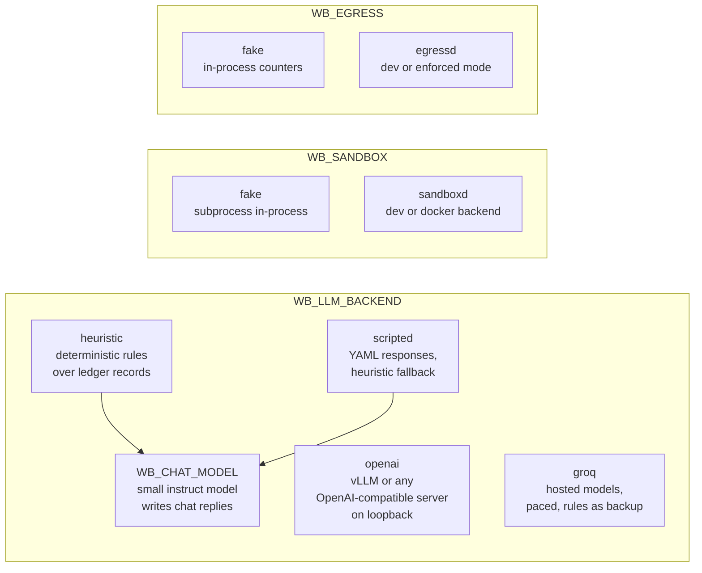
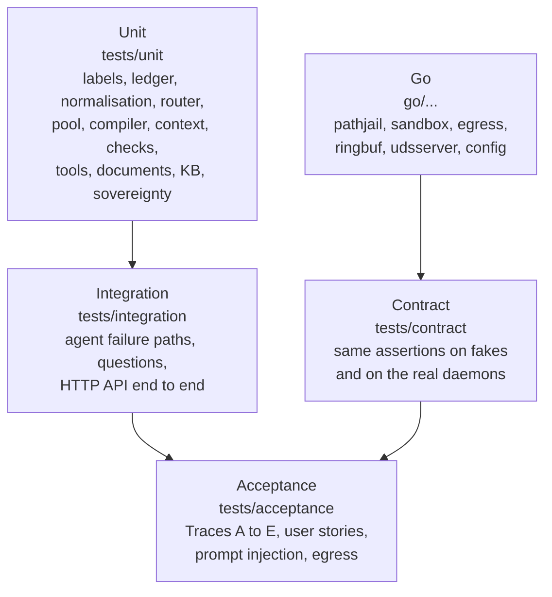

# Development Guide

Everything in this repository runs on a laptop without a GPU, Docker or network access. This guide covers the local setup, the test layers, the fixtures and evaluation, and how to extend the system.

## Contents

1. [Setup](#1-setup)
2. [Daily commands](#2-daily-commands)
3. [Backends and host services](#3-backends-and-host-services)
4. [Fixtures](#4-fixtures)
5. [Test layers](#5-test-layers)
6. [Evaluation](#6-evaluation)
7. [Extending the workbench](#7-extending-the-workbench)
8. [Code conventions](#8-code-conventions)
9. [Branches and commits](#9-branches-and-commits)
10. [Troubleshooting](#10-troubleshooting)

---

## 1. Setup

| Tool | Version | Needed for |
|---|---|---|
| Python | 3.11 or newer (developed and tested on 3.12) | everything |
| Go | 1.22 or newer | building and testing the daemons |
| Node.js | any recent version, optional | the syntax check of `app.js` in the hygiene test |
| Chrome | optional | manual UI checks |

```bash
python -m venv .venv
source .venv/bin/activate            # Windows: .venv\Scripts\Activate.ps1
pip install -e ".[dev]"
cp .env.example .env                 # then set WB_SANDBOX=fake and WB_EGRESS=fake for a quick start
python scripts/dev.py fixtures       # generate fixtures and seed var/
```

On Windows, `make` is usually missing; every Makefile target is `python scripts/dev.py <target>`. If your system drive is small, point the caches elsewhere, for example `UV_CACHE_DIR`, `PIP_CACHE_DIR`, `GOCACHE` and `GOMODCACHE` on another drive.

## 2. Daily commands

| Command | What it does |
|---|---|
| `python scripts/dev.py setup` | Install in editable mode, generate fixtures, seed `var/`. |
| `python scripts/dev.py fixtures` | Regenerate `fixtures/ws`, `fixtures/kb`, the asset register and the organisation templates, then run `workbench setup`. |
| `workbench setup --reset` | Wipe `var/` and seed it again. |
| `python scripts/dev.py serve` | Start the UI and API on `127.0.0.1:8080`. |
| `python scripts/dev.py test` | Run pytest (extra arguments are passed through). |
| `python scripts/dev.py lint` | `ruff check` and strict `mypy` on the core packages. |
| `python scripts/dev.py demo` | Traces A to E in a temporary root. |
| `python scripts/dev.py eval` | The evaluation report and a proposed `models.proposed.yaml`. |
| `python scripts/dev.py go-build` | Build `bin/sandboxd` and `bin/egressd` with the version stamped in. |
| `python scripts/dev.py go-test` | Go tests with coverage (`-race` where cgo is available). |
| `python scripts/dev.py go-lint` | `gofmt`, `go vet`, and a check that `go.mod` has no `require` lines. |
| `python scripts/dev.py go-integration` | Build the daemons, start them in dev mode and run the contract tests against them. |
| `python scripts/dev.py clean` | Remove `var/`, `run/`, `bin/`, `reports/` and tool caches. |

## 3. Backends and host services



- **heuristic** is the default. It implements every model purpose (routing, planning, extraction, drafting, summarising, answering, code) with rules over the records the orchestrator passes it, so the agent loop, checks and UI behave as they would with real models. It deliberately fails the first plan for Trace E and the first script for Trace B, so the repair and fix loops run.
- **scripted** replays `fixtures/scripts/<name>.yaml` (`WB_SCRIPTED_SCRIPT=<name>`) to drive failure paths, and falls back to the heuristic backend for unmatched calls.
- **chat model** is optional and independent of the choice above. Setting `WB_CHAT_MODEL` (for example
  `qwen2.5-1.5b-instruct`) sends only `chat.reply` requests to an instruct model on `WB_CHAT_ENDPOINT`, so
  greetings and follow-up questions read naturally while plans, tools, documents and checks stay deterministic.
  The suggestion buttons are still built from the workspace files the user may read, so the model cannot invent
  a file or a path, and if the model server is unreachable the deterministic reply is used and marked in the UI.
  `python scripts/dev.py chat-model` downloads llama.cpp and Qwen2.5-1.5B-Instruct once into `models/`
  (or `WB_MODELS_DIR`) and serves them on `127.0.0.1:8010`. On a two-core laptop a reply takes about three to
  six seconds.
- **groq** stands the inference layer in on a machine without a GPU. It sends the same calls to a hosted
  OpenAI-compatible service described in `config/groq.yaml`, with the key read from the environment variable that
  file names (`GROQ_API_KEY` in `.env`). The registry, the router and the agent loop are unchanged: only the
  endpoint behind the client differs, so the layer can be exercised with real model output before GPU hardware is
  available. Calls go out one at a time with a gap between them, a refusal is waited out for the interval the
  service states, and the deterministic rules answer if it gives up, so a rate limit cannot fail a task. Each
  model's remaining allowance appears in the model panel. This is the only backend that sends data off the
  machine: the host is listed in `config/egress_allowlist.yaml`, the security page states it, and the target
  deployment replaces it with vLLM on loopback.
- **openai** talks to the endpoints in `config/models.yaml`. The OpenAI-compatible client refuses endpoints that are neither loopback nor on the egress allowlist.

To run the real daemons locally:

```bash
python scripts/dev.py go-build
workbench render-go-config --backend dev --mode dev          # writes var/go-config/*.json
bin/sandboxd -config var/go-config/sandboxd.json
bin/egressd  -config var/go-config/egressd.json
```

On Windows, Python has no `AF_UNIX`, so the daemons listen on an ephemeral loopback port and write `run/<name>.addr` and `run/<name>.token`; the Python client reads both (`service_transport: auto`).

## 4. Fixtures

`scripts/make_fixtures.py` generates every input deterministically. Nothing in the fixtures is real data.

| Fixture | Purpose |
|---|---|
| `inspection_P108B.pdf` + `.ocr.json` | Trace A. Scanned report with seeded problems: a wrong tag in one row, an OCR confusion on the tag, a disagreeing work-order read, readings below the SOP minimum and a falling trend. |
| `inspection_P101A_clean.pdf` | A report that passes every check. |
| `inspection_P101A_injected.pdf` | A report whose remark tries to instruct the model. |
| `inspection_hindi_mixed.ocr.json` | Mixed Hindi and English markings and text. |
| `vendor_contract.pdf` | Trace C. A 40-page text PDF with numbered clauses. |
| `offer_a/b/c.pdf`, `tender_conditions.pdf` | Trace E. Commercial offers marked Secret, VENDOR-COMMERCIAL. |
| `pressure_readings.csv` | Trace B. Readings with injected anomalies. |
| `pipe_data.md` | Trace D. Design data for the wall-thickness calculation. |
| `board_notes.md` | Notes for the deck deliverable. |
| `fixtures/kb/` | Procedures with two revisions, P&ID tag lists, past approval notes, inspection history. |
| `fixtures/asset_register.csv` | Tags, classes, vendors, purchase orders, drawings. |
| `fixtures/eval/*.jsonl` | Evaluation sets (routing, extraction, consistency, revision, graph, provenance, plan compiler, labels, code). |
| `fixtures/scripts/*.yaml` | Scripted model outputs for failure-path tests. |

Scanned PDFs have an `.ocr.json` sidecar that stands in for PaddleOCR: page text, regions, and the values a vision model would read blind and after zooming.

## 5. Test layers



| Rule | Why |
|---|---|
| Sockets are disabled except loopback (`pytest-socket`). | A test that tries to reach the network fails instead of passing on a connected laptop. |
| Every test gets its own root in a temporary folder and a fixed clock. | Tests are independent and repeatable; ledger hashes are compared across runs. |
| `time_scale` is 0 in tests. | Tide waits and wake times do not slow the suite. |
| Property tests (`hypothesis`) cover tag and unit normalisation, date parsing and the label algebra. | The rules hold for inputs nobody thought of. |
| `WB_GO_BINARIES=1` switches the contract tests to the real daemons. | The Python fakes cannot drift from the Go behaviour. |
| `tests/unit/test_repo_hygiene.py` scans text files for em dashes and checks `app.js` with `node --check`. | Keeps the documentation style and catches UI syntax errors that no Python test would see. |
| `tests/ui` drives the real interface in Chrome through Playwright: a task from the home page to approval, the Details panel, and the Library tabs, including that the tab highlight slides and that updates patch the page in place. | Interaction bugs (a page that stops updating, a tab that does not switch) only show up in a browser. The tests skip themselves when Playwright or Chrome is missing; install Playwright with `pip install playwright`, no browser download is needed. |

Useful selections:

```bash
python -m pytest tests/unit -q
python -m pytest tests/acceptance -k trace_a -q
python -m pytest tests/integration/test_api.py -q
WB_GO_BINARIES=1 WB_RUN_DIR=... python -m pytest tests/contract    # normally via go-integration
```

## 6. Evaluation

`workbench eval` runs every dataset against the configured backend and writes `reports/eval.md` and `reports/eval.json`:

- demo traces, including Trace A as of 2023 and Trace A without templates;
- routing accuracy and selection regret;
- extraction precision and recall, dual-read agreement and uncertainty;
- consistency detection and false alarms, correct-revision rate, graph recall with and without expansion;
- number provenance and citation verification;
- plan validity before and after repair, label propagation, code pass rate;
- reliability over repeated runs and prefix-cache hit rates per label partition.

With the heuristic backend the numbers exercise the pipeline, not model quality. `--write-registry` folds the measured quality per route into `config/models.proposed.yaml` for review; `--refresh` also folds in outcomes of reviewed tasks.

## 7. Extending the workbench

### Add a tool

1. Create a handler `def my_tool(args: dict[str, Any], ctx: ToolContext) -> ToolResult` in a module under `workbench/tools/`. Write evidence with `ctx.rt.ledger.add(...)` and return the record ids in `ToolResult.records`.
2. Declare it in the module's `SPECS` list with a JSON Schema (`obj({...}, required)`), `output_type`, `side_effect` and a `budget_key`.
3. Add the module to `builtin_specs()` in `workbench/tools/__init__.py` and a budget to `step_budgets_s` in `config/settings.yaml`.
4. If other steps consume its output, add the output type to their `accepts` lists (`planning/compiler.py`, `planning/model_tasks.py`).
5. Test it in `tests/unit/test_tools_docs_kb.py`, including a label and a failure case.

Side-effecting tools are gated automatically. Tools must not open network connections or change labels.

### Add a model task

Add a `ModelTaskSpec` to `workbench/planning/model_tasks.py`, a prompt in `workbench/llm/prompts/<name>.j2`, a schema in `schemas/` if the output is structured, and a handler `_<purpose>` in `HeuristicBackend` so the offline path keeps working.

### Add a plan template

Create `templates/<name>.yaml` with `name`, `version`, `match`, `deliverables` and `steps`. Placeholders such as `{attachments[0]}`, `{report_date}`, `{equipment_tag}` and `{<step_id>}` are resolved at run time. The compiler validates the template the first time it is instantiated; a template test in `tests/unit/test_planning_context_checks.py` is the quickest check.

### Add a consistency rule

Create `rules/consistency/<name>.yaml` with `left`, `right`, `compare` and `on_fail`. Sources include extracted facts, the asset register, calibration data, KB limits and trends. Add a positive and a negative case to `fixtures/eval/consistency.jsonl`.

### Add a model

Add an entry with `status: shadow` to `config/models.yaml` (capabilities, context, protocol, `serve` per profile), then `workbench registry shadow <name>` and `workbench registry promote <name>`. No code changes are needed.

## 8. Code conventions

- Python: the `ruff` rules in `pyproject.toml`, `from __future__ import annotations`, Pydantic models for anything crossing a boundary, SQLAlchemy Core for storage.
- `mypy --strict` must pass on `core`, `planning`, `checks` and `router`.
- Go: standard library only, `gofmt`, `go vet`, table-driven tests, JSON structured logs via `log/slog`.
- UI: vanilla JavaScript and CSS, no build step, no external requests, light and dark themes through CSS variables.
- Documentation and UI text: plain English, no em dashes.
- Configuration and secrets: nothing secret is committed; `.env` is ignored.

## 9. Branches and commits

| Branch | Contents |
|---|---|
| `main` | Released state: both feature branches merged, root documentation. |
| `feature/agentic-layer` | The Python agentic layer, UI, fixtures, tests and documentation. |
| `feature/host-services` | The Go daemons and deployment artifacts, built on top of the agentic layer. |

Commit messages are short imperative sentences describing the change.

## 10. Troubleshooting

| Symptom | Cause and fix |
|---|---|
| Health shows `degraded` | The daemons are not running. Start them, or set `WB_SANDBOX=fake` and `WB_EGRESS=fake`. |
| `fixtures are missing` | Run `python scripts/dev.py fixtures`. |
| Tests fail with `SocketBlockedError` | Code tried to open a non-loopback connection; that is the point of the guard. |
| The UI shows stale behaviour | Assets are content-hashed, so a hard refresh is enough after a server restart. |
| `egressd` exits in enforced mode | The nftables table or drop policy is missing, or `/etc/resolv.conf` has a nameserver. Use `--mode dev` locally. |
| Go tests skip `-race` on Windows | The race detector needs cgo and a C toolchain. |
