# Sovereign AI Workbench: Diagrams

## 1. System Architecture

```mermaid
flowchart TB
    U["User browser<br/>plant LAN only, port 443"]

    subgraph UI["Workbench layer"]
        direction TB
        WB["Workbench UI + API<br/>FastAPI + bundled SPA, no CDN"]
        WS["Workspaces<br/>inputs/ · drafts/ · final/ · per-user ACL"]
        PANELS["Panels<br/>plan view · live trace · evidence · citations<br/>consistency · routing explanation · model panel<br/>classification banner · job queue · egress badge"]
        WB --> WS --> PANELS
    end

    subgraph CTRL["Control layer (CPU)"]
        direction TB
        ORCH["Orchestrator<br/>agent loop · approval gates · escalation"]
        POL["Policy engine<br/>labels · high-water mark · provenance policy"]
        RT["Router<br/>rules → 1.5B CPU classifier → constraints → capability score"]
        PLAN["Plan layer<br/>template library · plan compiler · template promotion"]
        JQ["Job queue<br/>per-model limits · swap queue · OCR worker pool"]
        ORCH --> POL --> RT --> PLAN --> JQ
    end

    subgraph EVID["Evidence layer"]
        direction TB
        LED[("Evidence ledger<br/>typed · labelled · anchored · hashed records")]
        CCOMP["Context compiler<br/>fixed prefix + plan + step inputs"]
        VERIFY["Citation verification<br/>+ number provenance"]
        LED --> CCOMP --> VERIFY
    end

    subgraph TOOLS["Tool layer"]
        direction TB
        FS["File I/O<br/>workspace-jailed, drafts/ only"]
        SB["Sandbox<br/>docker --network none"]
        MM["OCR + VLM pipeline<br/>PaddleOCR · Qwen3-VL · dual-read"]
        KB["Knowledge base<br/>BGE-M3 hybrid · reranker · revision-aware"]
        PGT["Plant graph lookup"]
        CC["Consistency checker<br/>YAML rules · pint · date math"]
        CALC["Calculator<br/>sympy + pint"]
        RD["Renderers<br/>docx · xlsx · pptx"]
        FS ~~~ SB ~~~ MM ~~~ KB ~~~ PGT ~~~ CC ~~~ CALC ~~~ RD
    end

    subgraph INF["Inference layer (GPU, 127.0.0.1 only)"]
        direction TB
        POOL["Tidal pool manager<br/>sleep / wake · label-salted prefix cache"]
        M1["vLLM :8001 · Qwen3-VL-8B 4-bit<br/>general · document · vision · agentic<br/>n-gram speculative decoding"]
        M2["vLLM :8002 · Qwen2.5-Coder-7B AWQ<br/>code-block protocol<br/>n-gram speculative decoding"]
        M3["vLLM :8003 · gpt-oss-20b<br/>reasoning · escalation target<br/>swap slot, asleep in host RAM"]
        REG[("Model registry<br/>models.yaml · quality tables · speculative config")]
        POOL --> M1 --> M2 --> M3
        REG --> POOL
    end

    subgraph STORE["Storage (LUKS-encrypted /srv)"]
        direction TB
        QD[("Qdrant on-disk")]
        GR[("Plant graph · SQLite")]
        AUD[("Hash-chained audit log")]
        MODELS[("Model weights · signed manifest")]
        QD ~~~ GR ~~~ AUD ~~~ MODELS
    end

    subgraph SOV["Sovereignty layer (host)"]
        direction TB
        NFT["nftables · output policy drop<br/>allowlist: directory server only"]
        SINK["egress0 sinkhole default route<br/>no upstream DNS"]
        EBPF["eBPF / auditd connect() probe"]
        MON["Egress monitor<br/>packets · connect() calls · conntrack"]
        NFT --> SINK --> EBPF --> MON
    end

    U --> UI
    UI --> CTRL
    CTRL --> EVID
    EVID --> TOOLS
    TOOLS --> INF
    INF --> STORE
    STORE --> SOV
    MON -. "live counters" .-> WB
```

## 2. End-to-End Request Lifecycle

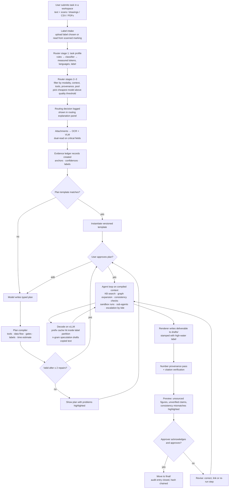

## 3. Agent Loop with Templates, Compiler and Escalation

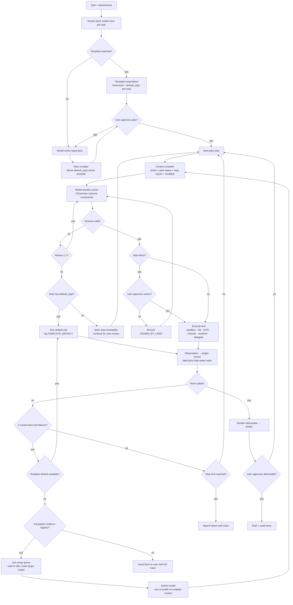

## 4. Router and Model Registry

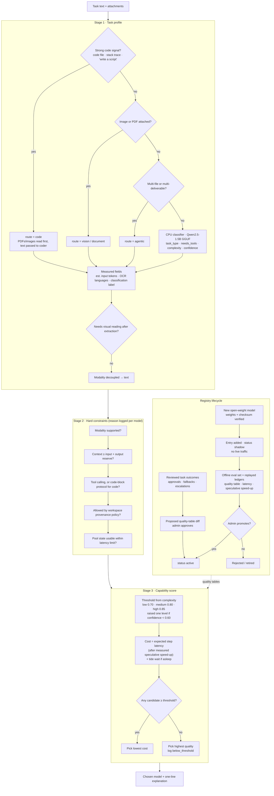

## 5. Single-GPU Inference: Tidal Pool, Salted Cache, Speculative Decoding

```mermaid
flowchart TB
    subgraph BOOT["Startup order (Profile S, 24 GB)"]
        direction TB
        B1["Start swap slot · gpt-oss-20b<br/>gpu-memory-utilization 0.60"]
        B2["Sleep level 1<br/>weights → host RAM, KV freed"]
        B3["Start Qwen3-VL-8B · 0.50 · 32k FP8 KV<br/>speculative: ngram k=3"]
        B4["Start Qwen2.5-Coder-7B · 0.38 · 16k FP8 KV<br/>speculative: ngram k=4"]
        B5["Install benchmark<br/>FP8 KV · sleep mode · MXFP4 · speculation combos"]
        B1 --> B2 --> B3 --> B4 --> B5
    end

    subgraph REQ["Per request"]
        direction TB
        Q1["Request with task label + compartments"]
        Q2["cache_salt = HMAC(server key, label, compartments)"]
        Q3["Prompt layout contract<br/>system → tool schemas → plan → evidence → new observation"]
        Q4{"Prefix blocks cached<br/>in same salt partition?"}
        Q5["Reuse KV blocks<br/>prefill only new evidence"]
        Q6["Full prefill<br/>chunked alongside other decodes"]
        Q1 --> Q2 --> Q3 --> Q4
        Q4 -- yes --> Q5
        Q4 -- no --> Q6
    end

    subgraph DEC["Decode"]
        direction TB
        D1{"Speculation enabled on this instance?"}
        D2["Prompt lookup: last 2–5 tokens<br/>searched in this request's context"]
        D3["Draft k tokens<br/>copied tags · numbers · clauses · script lines"]
        D4["Target verifies k tokens in one pass"]
        D5["Keep accepted prefix + 1 corrected token"]
        D6["Plain decode, one token per step"]
        D7["Stream tokens · log acceptance length"]
        D1 -- yes --> D2 --> D3 --> D4 --> D5 --> D7
        D1 -- no --> D6 --> D7
    end

    subgraph TIDE["Tidal escalation"]
        direction TB
        T1["Escalated or reasoning job<br/>ledger kept"]
        T2["Swap queue"]
        T3{"Oldest wait > 90 s<br/>or 3 jobs queued?"}
        T4["Let resident steps finish"]
        T5["Sleep VL + coder"]
        T6["Wake gpt-oss-20b"]
        T7["Run queued jobs<br/>one re-prefill each, speculation off"]
        T8["Sleep swap model"]
        T9["Wake residents<br/>min 120 s before next tide"]
        T1 --> T2 --> T3
        T3 -- no --> T2
        T3 -- yes --> T4 --> T5 --> T6 --> T7 --> T8 --> T9
    end

    subgraph SCALE["Profiles M / L"]
        direction TB
        L1["All models resident, no tides"]
        L2["Reasoning model with EAGLE-3 head<br/>if one exists for that checkpoint"]
        L3["Embedder + reranker on GPU"]
        L1 --> L2 --> L3
    end

    BOOT --> REQ --> DEC --> TIDE --> SCALE
```

## 6. Speculative Decoding: Selection, Benchmark and Safeguards

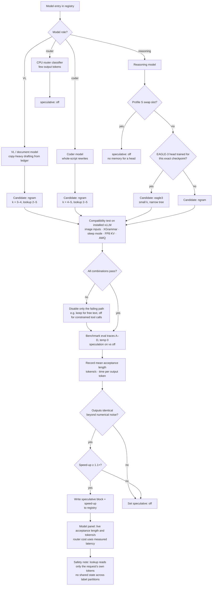

## 7. Evidence Ledger and Context Compilation

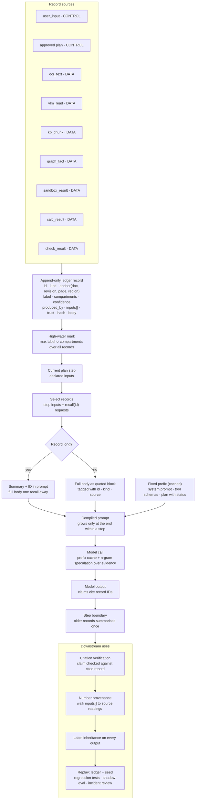

## 8. Multimodal Pipeline and Dual-Read Reconciliation

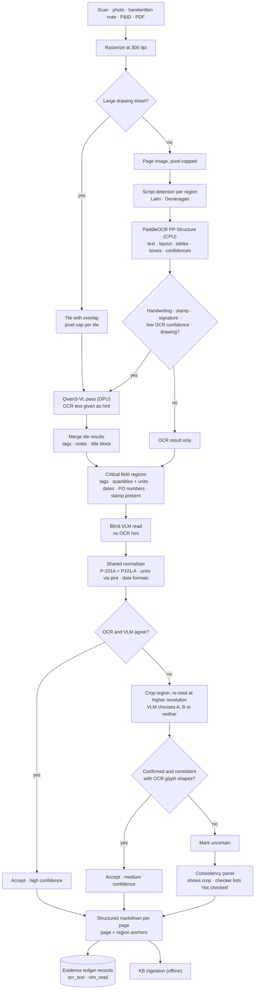

## 9. Knowledge Base: Ingestion, Revisions, Plant Graph and Retrieval

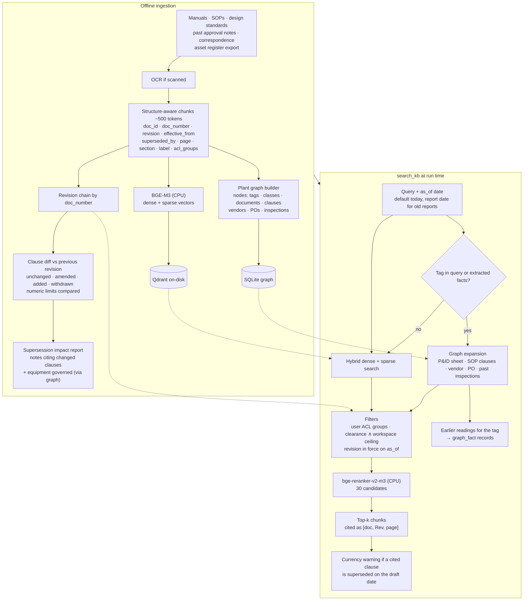

## 10. Deliverable Pipeline: Checks, Provenance and Approval

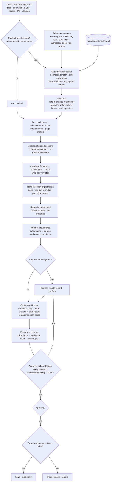

## 11. Classification Labels and Need-to-Know

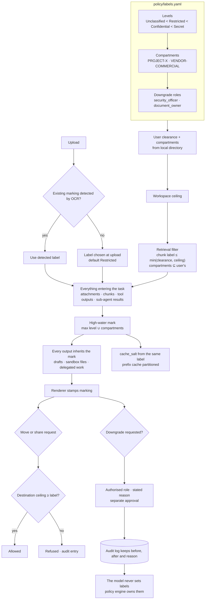

## 12. Sovereignty Enforcement and Live Proof

```mermaid
flowchart TB
    subgraph ENF["Enforcement on the server"]
        direction TB
        E1["Model servers bind 127.0.0.1 only<br/>UI is the only LAN service (443)"]
        E2["nftables input: drop by default<br/>allow LAN → 443, optional admin SSH"]
        E3["nftables output: drop by default<br/>allow lo · established · LDAPS allowlist"]
        E4["egress0 dummy default route (IPv4 + IPv6)<br/>stray packets reach the output hook and are counted"]
        E5["No upstream DNS<br/>internal names in /etc/hosts"]
        E6["Docker bridge disabled<br/>sandboxes --network none"]
        E7["Offline env vars<br/>HF_HUB_OFFLINE · TRANSFORMERS_OFFLINE<br/>VLLM_NO_USAGE_STATS · DO_NOT_TRACK"]
        E8["No web tool exists in the agent"]
        E1 --> E2 --> E3 --> E4 --> E5 --> E6 --> E7 --> E8
    end

    subgraph MON["Independent monitors"]
        direction TB
        M1["nftables counter egress_blocked<br/>dropped packets"]
        M2["eBPF / auditd on connect()<br/>PID → container via cgroup"]
        M3["conntrack events<br/>non-LAN connections"]
        M4["tcpdump on uplink<br/>or uplink unplugged"]
        M1 --> M2 --> M3 --> M4
    end

    BADGE["Egress badge<br/>External connections 0 · Blocked packets N<br/>Blocked connect() N (host · sandbox)"]

    subgraph TEST["Run egress test button"]
        direction TB
        T1["Host: curl https://1.1.1.1"]
        T1R["Fails instantly<br/>packets +1 and host connect() +1"]
        T2["Host: curl https://example.com"]
        T2R["Fails at DNS<br/>nothing leaves"]
        T3["Sandbox: socket.create_connection 1.1.1.1:443"]
        T3R["Network unreachable<br/>sandbox connect() +1, packets unchanged"]
        T1 --> T1R --> T2 --> T2R --> T3 --> T3R
    end

    subgraph AUDIT["Tamper-evident audit"]
        direction TB
        A1["Append-only JSONL<br/>routing · model calls · tool calls · approvals"]
        A2["Each entry holds previous entry's hash"]
        A3["Latest hash to LAN log host"]
        A4["Signed daily summary<br/>officer countersigns"]
        A1 --> A2 --> A3 --> A4
    end

    ENF --> MON --> BADGE --> TEST --> AUDIT
```

## 13. Demo Trace A: Scanned Inspection Report → Approval Note

```mermaid
flowchart TB
    A1["Engineer<br/>uploads scanned inspection report (Confidential)<br/>+ 'Draft approval note'"]
    A2["Router<br/>rule attachment:pdf → document / vision<br/>qwen3-vl-8b · decision logged"]
    A3["Plan layer<br/>template approval_note_from_scan v3 matched"]
    A4["Plan view<br/>extract → ground → check → draft → render"]
    A5{"Engineer approves plan?"}
    A6["read_document<br/>OCR (CPU) + VLM on stamps and handwritten remarks"]
    A7["Dual-read on critical fields<br/>OCR 'P-1O8B' vs VLM 'P-108B'"]
    A8["Crop re-read at higher resolution<br/>VLM confirms P-108B · medium confidence"]
    A9[("Ledger records<br/>findings with page + region anchors")]
    A10["search_kb · as_of = report date<br/>graph expansion on P-108B"]
    A11[("Ledger records<br/>SOP-MECH-014 Rev 5 clauses<br/>two past inspections as graph_fact")]
    A12["check_consistency<br/>asset register · SOP limits · trend rule"]
    A13["Findings<br/>1 tag mismatch · 1 thickness below minimum<br/>1 trend crossing limit before next inspection"]
    A14["Draft cited sections<br/>schema-constrained<br/>n-gram speculation copies tags and figures"]
    A15["make_docx from org template<br/>drafts/approval-note.docx"]
    A16["Stamp high-water label<br/>Confidential"]
    A17["Number provenance + citation verification<br/>all figures sourced · claims verified"]
    A18["Preview<br/>click a figure → derivation chain → scan crop"]
    A19{"Engineer acknowledges 3 findings<br/>and approves?"}
    A20["final/approval-note.docx<br/>audit entry chained"]
    A21["Engineer tries to share into<br/>Restricted workspace"]
    A22["Refused: label above ceiling<br/>logged in audit"]
    A23["Egress badge still reads<br/>External connections 0"]

    A1 --> A2 --> A3 --> A4 --> A5
    A5 -- edit --> A4
    A5 -- yes --> A6 --> A7 --> A8 --> A9 --> A10 --> A11 --> A12 --> A13
    A13 --> A14 --> A15 --> A16 --> A17 --> A18 --> A19
    A19 -- no --> A14
    A19 -- yes --> A20 --> A21 --> A22 --> A23
```

## 14. Demo Traces B and E: Sandbox Code and Reasoning Escalation

```mermaid
flowchart TB
    subgraph TB_["Trace B · code verified in sandbox"]
        direction TB
        B1["Engineer<br/>'Parse these pressure readings and flag anomalies' + CSV"]
        B2["Router<br/>rule code_intent → qwen2.5-coder-7b"]
        B3["Coder (code-block protocol)<br/>one fenced block: script + assertions"]
        B4["Sandbox · --network none · 60 s<br/>exit 1 · assertion failed"]
        B5["Orchestrator feeds back<br/>exit code · trimmed stdout · first traceback lines"]
        B6["Coder rewrites script<br/>unchanged lines accepted fast by n-gram speculation"]
        B7["Sandbox rerun<br/>exit 0 · all assertions pass"]
        B8["Deliverables<br/>script · results table · chart<br/>acceptance length shown in model panel"]
        B1 --> B2 --> B3 --> B4 --> B5 --> B6 --> B7 --> B8
    end

    subgraph TE_["Trace E · offer comparison, no template"]
        direction TB
        E1["Buyer<br/>'Compare these 3 offers against the tender' + 3 PDFs"]
        E2["Attachments read → ledger<br/>modality decoupled to text"]
        E3["Classifier<br/>agentic · complexity high → threshold 0.85"]
        E4["Scores<br/>qwen3-vl-8b 0.72 ✗ · gpt-oss-20b 0.85 ✓ (+ tide wait)"]
        E5["Swap queue<br/>tide turns: residents finish and sleep"]
        E6["gpt-oss-20b wakes<br/>speculation off in swap slot"]
        E7["Model writes typed plan"]
        E8["Plan compiler<br/>error: step 3 input never produced"]
        E9["Model repairs plan<br/>compiler passes · time estimate shown"]
        E10{"Buyer approves plan?"}
        E11["Sandbox builds comparison table<br/>sandbox_result record"]
        E12["comparison.xlsx with live formulas<br/>+ recommendation note, every figure traced"]
        E13["Tide reverses<br/>swap model sleeps · residents wake"]
        E1 --> E2 --> E3 --> E4 --> E5 --> E6 --> E7 --> E8 --> E9 --> E10
        E10 -- yes --> E11 --> E12 --> E13
        E10 -- edit --> E7
    end

    PROOF["Routing explanation panel<br/>three models chosen across traces A, B, C, E"]
    TB_ --> TE_ --> PROOF
```

## 15. Deployment, Supply Chain and Hardware Profiles

```mermaid
flowchart TB
    subgraph STAGE["Staging machine (outside the plant)"]
        direction TB
        S1["Download safetensors weights<br/>OCR models · pip wheels"]
        S2["Build images · pin by digest<br/>workbench · sandbox py311 · vLLM"]
        S3["SBOM + offline vulnerability scan"]
        S4["SHA-256 manifest signed with org key"]
        S1 --> S2 --> S3 --> S4
    end

    MEDIA["Approved removable media"]

    subgraph INSTALL["Offline installer on the target"]
        direction TB
        I1{"Signature and every hash valid?"}
        I2["Refuse to start"]
        I3["Load onto LUKS-encrypted /srv"]
        I4["Apply nftables · sinkhole route · disable DNS"]
        I5["Start swap slot → sleep → start residents"]
        I6["Install benchmark<br/>FP8 KV · sleep · MXFP4 · speculation · latency budget"]
        I7["Write measured values to registry"]
        I1 -- no --> I2
        I1 -- yes --> I3 --> I4 --> I5 --> I6 --> I7
    end

    subgraph RUN["Running stack (docker-compose)"]
        direction TB
        R1["UI + API · :443 LAN"]
        R2["Orchestrator · policy engine · job queue · pool manager"]
        R3["Router classifier · llama.cpp CPU"]
        R4["Qdrant · BGE-M3 · reranker · PaddleOCR (CPU)"]
        R5["vLLM :8001 VL · :8002 coder (ngram spec)"]
        R6["vLLM :8003 gpt-oss-20b swap slot"]
        R7["Sandbox containers · no network"]
        R8["Ledger · plant graph · audit log (SQLite / JSONL)"]
        R9["Egress monitor · syscall audit"]
        R1 --> R2 --> R3 --> R4 --> R5 --> R6 --> R7 --> R8 --> R9
    end

    subgraph PROF["Hardware profiles (same code, registry changes only)"]
        direction TB
        P1["S · 1× 24 GB · ≥ 64 GB RAM<br/>VL + coder resident, reasoning in swap slot<br/>ngram speculation on residents"]
        P2["M · 1× 48 GB<br/>all resident · embedder + reranker on GPU"]
        P3["L · 1–2× 80 GB<br/>larger VL · Qwen3-Coder class · gpt-oss-120b<br/>EAGLE-3 head where available"]
        P4["Scaling path<br/>FlashAttention-3 · MLA / NSA models · TP / PP / EP<br/>PD / PPD disaggregation"]
        P1 --> P2 --> P3 --> P4
    end

    STAGE --> MEDIA --> INSTALL --> RUN --> PROF
```
