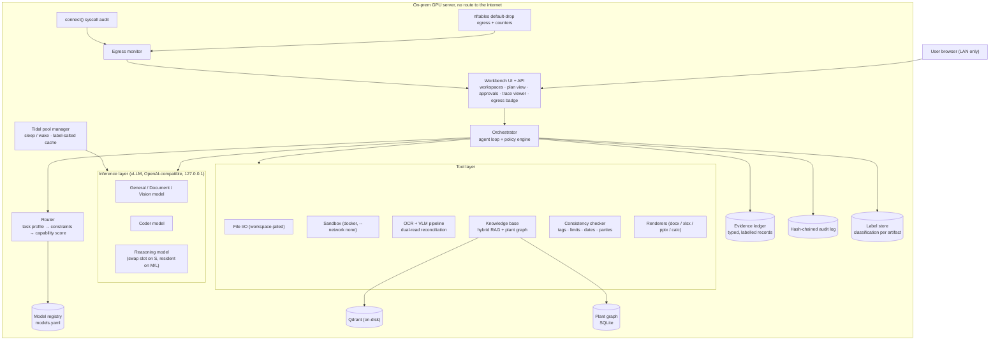
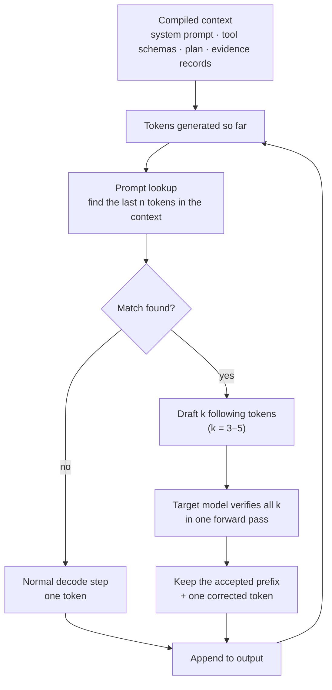
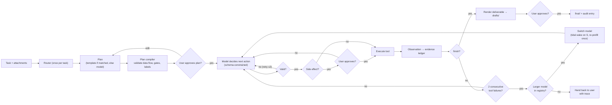
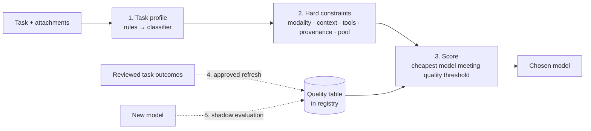
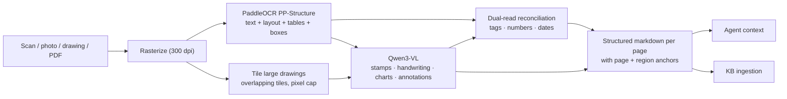
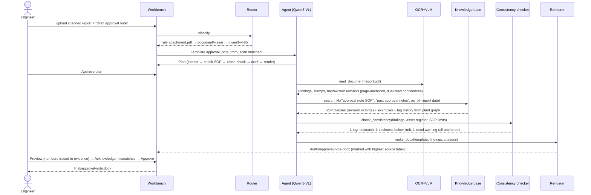
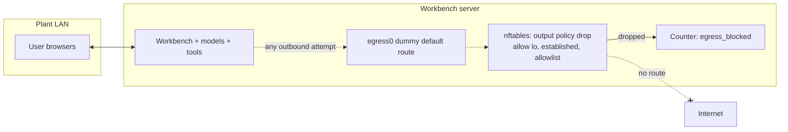

# Sovereign AI Workbench: End-to-End System Design

*A self-hosted, air-gapped AI workbench for refineries, PSUs, defence-linked manufacturing and government offices. It runs entirely on the organization's own GPU server, routes each task to the right open-weight model, acts as a tool-using agent, reads scans and drawings, produces real deliverables, and proves that nothing leaves the premises.*

---

## 0. Requirement Traceability

| Problem-statement requirement | Where it is satisfied | Demo evidence |
|---|---|---|
| Fully on-prem, air-gapped | §6 Sovereignty | Live egress badge + blocked `curl` test |
| Multiple open-weight models, automatic selection | §4.2 Capability-scored router, §3.0.2 Tidal model pool | Routing log with candidate scores and rejection reasons across 4 task types; reasoner woken on demand in Trace E |
| New models addable without redesign | §4.2 Model registry, §4.2.5 Shadow onboarding | Add one registry entry, run shadow evaluation, promote |
| Agentic: plan, tools, iterate | §4.1 Agent loop, §4.1.2 Plan templates, §4.1.4 Plan compiler, §4.3 Tools | Trace A, Trace B, Trace E (untemplated) |
| Sandboxed code execution + verification | §4.4 Sandbox | Trace B (fail → fix → pass) |
| Scans, handwriting, drawings, photos | §4.5 Multimodal pipeline | Trace A |
| Real deliverables (Word/Excel/PPT, code, calculations) | §4.6 Renderers | `approval-note.docx`, `calc-sheet.xlsx` |
| Grounding in manuals, SOPs, correspondence | §4.7 Knowledge base | Page-level citations in outputs |
| Runs on one mid-range GPU | §3.0 Profile S (24 GB), §4.9 Latency budget | Everything above on one workstation, with measured timings |
| Indian-language and bilingual documents | §4.5 Multimodal pipeline | Hindi/English scan in Trace A test set |
| Trustworthy supply chain (weights, images) | §6.4 Supply-chain integrity | Verified checksum manifest at install |
| Measured, not asserted, quality | §5.6 Evaluation | Extraction precision/recall, routing accuracy |
| Confidentiality inside the premises, not only at the boundary | §6.5 Classification labels | Draft inherits the highest source marking; lower-cleared share is refused |
| Engineering value beyond summarisation | §4.6.1 Consistency checks | Seeded tag and limit mismatches flagged in Trace A |
| Grounding against the revision in force | §4.7.1 Revision-aware retrieval | Revision-stamped citations and a supersession impact report |
| Every claim and number traceable to evidence | §4.1.3 Evidence ledger, §4.6.2 Number provenance | Click any figure in the draft to see its source reading or derivation |
| Reliable reading of tags, figures and dates | §4.5.1 Dual-read reconciliation | Seeded OCR confusion (`8`/`B`) caught and shown with the cropped region |
| Equipment-level context, not only text similarity | §4.7.2 Plant graph retrieval | Inspection history trend for the reported tag appears in Trace A |
| No cross-user leakage through shared GPU caches | §3.0.3 Label-salted prefix cache | Cache hit rate per label partition in the model panel |
| Fast enough decoding on one mid-range GPU | §3.0.4 Evidence-aware speculative decoding | Tokens/s and acceptance length with speculation on and off; identical outputs at temperature 0 |

---

## 1. System Overview



**Design principles.** Every component speaks to the others over loopback. The server accepts connections from LAN clients but opens no new outbound connections except to an explicit allowlist (the directory server, §6.1). No web tool exists, so the agent cannot leak data even if it tries. Model choice is configuration, not code. Every file, chunk and output carries a classification label, and outputs never carry a lower label than their sources. Humans approve anything that leaves the draft area.

### 1.1 What Is New in This Design

The design keeps proven open-source components as its substrate (vLLM for serving, Qdrant for vectors, PaddleOCR for text, Docker for isolation), because replacing them would add risk without adding value. What is new is the control layer built on top of them: how context is assembled, how models are chosen and scheduled, how documents are read, and how every output is tied back to evidence. Each mechanism below is additive; switching it off returns the system to the conventional behaviour in the middle column.

| Layer | Conventional approach | This design | Section |
|---|---|---|---|
| Agent context | Raw, growing chat history | **Evidence ledger:** the prompt is compiled from typed, labelled, anchored evidence records; claims cite record IDs | §4.1.3 |
| Planning | Free-form plan text, or fixed scripts | **Plan compiler:** free-form plans are compiled into a validated data-flow graph before approval; approved runs can become templates | §4.1.4 |
| Model selection | Task label → fixed model | **Capability-scored router:** task profile, hard constraints (modality, context, provenance), cheapest model that meets a measured quality threshold | §4.2 |
| GPU use on one card | Only the models that fit stay loaded | **Tidal model pool:** a larger reasoning model sleeps in host RAM and is woken in batches, so Profile S has a real escalation target | §3.0.2 |
| KV cache sharing | Shared across all requests | **Label-salted prefix cache:** reuse only within the same classification partition, with a fixed prompt layout that maximises hits inside it | §3.0.3 |
| Document reading | OCR, optionally followed by a VLM | **Dual-read reconciliation:** critical fields are read independently by OCR and VLM, and disagreements trigger a targeted re-read | §4.5.1 |
| Grounding | Text similarity search | **Plant graph retrieval:** equipment tags link documents, clauses, vendors and inspection history; retrieval expands along those links | §4.7.2 |
| Output checking | Citation per paragraph, if any | **Number provenance:** every figure in a deliverable must resolve to a source reading or a recorded computation | §4.6.2 |
| Decoding speed | Plain token-by-token decode, or a generic draft model | **Evidence-aware speculative decoding:** zero-training prompt-lookup drafting that exploits how much of a draft note or rewritten script already sits in the compiled context; draft method is a registry field and is switched off where it does not pay | §3.0.4 |
| Cross-document review | Left to the reader | **Deterministic consistency checks** with YAML rules | §4.6.1 |
| Standards currency | Latest document only | **Revision-aware retrieval** with clause diff and supersession impact | §4.7.1 |
| Internal confidentiality | Folder permissions | **Classification high-water mark** enforced by the orchestrator | §6.5 |
| Sovereignty claim | Stated in documentation | **Two independent egress counters** (packets and `connect()` calls), live in the UI | §6.1, §6.2 |

---

## 2. The Workbench Layer (what the user actually works in)

A chat window is not a workbench. Industrial users need a place where files, plans, evidence and outputs live together, and where they stay in control. This layer is shaped by three findings from agent research:

- **The interface matters as much as the model.** SWE-agent showed that a purpose-built *agent–computer interface* (concise file viewers, guarded edit commands, clear error feedback) substantially improves agent success over giving the model a raw shell [27]. OpenHands showed the value of one platform combining sandboxed execution, a workspace and an event stream the user can inspect [28]. We apply both: tools return short, structured observations, and every action is visible in the UI.
- **Code as the action language for computation.** CodeAct found that letting agents act by writing executable Python outperforms rigid JSON-only actions on multi-step tasks [29]. We use JSON tool calls for file/KB/render actions and sandboxed Python for anything computational.
- **Humans at decision gates.** Atlassian's HULA framework, deployed internally, has engineers review and refine the agent's plan and code before it proceeds, and engineers reported reduced time and effort, especially when starting a plan [30]. We add the same gates: plan approval and deliverable approval.

### 2.1 Workbench features

| Feature | Purpose |
|---|---|
| **Workspaces (per project)** | Folder of inputs, drafts and final outputs; per-user ACL; the agent only sees its own workspace |
| **Plan view** | Agent's plan shown before execution; user can edit, reorder or reject steps |
| **Live trace** | Each step: model used, tool called, arguments, observation, latency |
| **Artifact preview** | Render docx/xlsx/pptx/code/results in-browser before download |
| **Approval gates** | Side-effecting actions (overwrite, move to `final/`) need a click |
| **Classification banner** | Workspace ceiling and the current draft's inherited marking, shown on every view and stamped on every export (§6.5) |
| **Consistency panel** | Cross-document checks for the current task: pass, mismatch or not found, each with both sources side by side (§4.6.1) |
| **Citations panel** | Every claim linked to source document + page; claims that fail citation verification (§4.6) are flagged |
| **Egress badge** | `External connections: 0 · Blocked packets: N · Blocked connect() calls: N (host N · sandbox N)` + "Run egress test" button |
| **Model panel** | Registry contents, pool state (resident, asleep, waking), GPU memory, cache hit rate per label partition, which model served each task |
| **Routing explanation** | For each task: the task profile, every candidate model with its score or rejection reason, and the chosen model (§4.2) |
| **Evidence view** | Ledger records for the task (§4.1.3); clicking a claim or figure in a draft opens the record and its page region |
| **Job queue** | Position in queue and running jobs, since several users share one GPU (§4.8) |

All frontend assets (JS, CSS, fonts, icons) are bundled locally; the page makes no CDN requests.

---

## 3. Inference Layer

### 3.0 What actually runs (demo) vs. scaling path

Appendix A is the full technical reference for these techniques. This table states plainly which techniques are **enabled in the demo** and which are the **production scaling path**.

| Technique | Demo (single GPU) | How |
|---|---|---|
| Paged KV cache (§A.2.1) | ✅ | vLLM default |
| Automatic prefix caching (§A.2.2) | ✅ | `--enable-prefix-caching` (default in recent vLLM) |
| Chunked prefill (§A.7.3) | ✅ | vLLM default in V1 engine |
| W4A16 AWQ/GPTQ with Marlin kernels (§A.2.3) | ✅ | Quantized checkpoints |
| FP8 KV cache | ✅ (verify) | `--kv-cache-dtype fp8`; support on Ampere depends on vLLM version and attention backend (see below) |
| XGrammar structured output (§A.8) | ✅ | vLLM structured-output backend |
| FlashAttention-2 / FlashInfer | ✅ | vLLM attention backend (Ampere/Ada) |
| Visual-token budget | ✅ | Cap image pixels per request (§A.6) |
| vLLM sleep mode for the tidal pool (§3.0.2) | ✅ (verify) | `--enable-sleep-mode`; `/sleep` and `/wake_up` endpoints on the loopback port |
| Per-request cache salt (§3.0.3) | ✅ (verify) | `cache_salt` request field; fallback described in §3.0.3 |
| Speculative decoding, n-gram / prompt lookup (§3.0.4) | ✅ (verify) | `--speculative-config` with `method: ngram` on the VL and coder instances; kept only if install benchmark shows a gain |
| Speculative decoding, EAGLE-3 draft head (§3.0.4, §A.4) | ⚙️ optional | Reasoning model on Profiles M/L, only if a head trained for that exact checkpoint exists |
| FlashAttention-3 (§A.3.1) | 🔭 scaling | Requires Hopper (H100/H200) |
| MLA / Native Sparse Attention (§A.5.1, §A.3.2) | 🔭 scaling | Requires models *trained* with them (e.g., DeepSeek family) |
| KV eviction, FastV/ToMe (§A.5.2, §A.6) | 🔭 scaling | Not stock vLLM features |
| TP / PP / EP / DP (§A.2.4) | 🔭 scaling | Multi-GPU servers |
| PD / PPD disaggregation (§A.7) | 🔭 scaling | Multi-node clusters |

### 3.0.1 Hardware profiles and model lineup

Models are defined only in the registry (§4.2), so this lineup is a starting point. **Check for newer open-weight releases at deployment time**, since this field moves quickly.

| Profile | Hardware | General / Document / Vision | Coder | Reasoning / planner | CPU-side |
|---|---|---|---|---|---|
| **S (demo)** | 1× 24 GB, ≥ 64 GB host RAM | Qwen3-VL-8B-Instruct, 4-bit | Qwen2.5-Coder-7B-Instruct-AWQ (code-block protocol, §4.1.1) | gpt-oss-20b in the swap slot (§3.0.2); fallback Qwen3-8B-AWQ in thinking mode | Router, BGE-M3, reranker, PaddleOCR |
| **M** | 1× 48 GB | same | same | gpt-oss-20b | same |
| **L ("120B class")** | 1–2× 80 GB | same or larger VL | Qwen3-Coder class | gpt-oss-120b | same |

All listed LLMs (Qwen3-VL, Qwen2.5-Coder, Qwen2.5-1.5B router, gpt-oss) are Apache-2.0, and PaddleOCR is Apache-2.0; BGE-M3 is MIT. Permissive licences are preferred over custom-licence models for PSU/defence deployment. **Confirm each licence on the model card at deployment time.** **Fallback for S:** Qwen2.5-VL-7B-AWQ + Qwen2.5-Coder-7B-AWQ (the original lineup) if Qwen3-VL causes issues.

**Why one model for general + vision on Profile S.** Every vLLM process pre-reserves its own GPU memory share and carries CUDA-context and CUDA-graph overhead (roughly 0.5–1 GB each). Merging general and vision into one VL model removes an instance. Moving the router, embedder, reranker and OCR to CPU frees the GPU for the two LLMs:

| vLLM instance (Profile S) | `--gpu-memory-utilization` | `--max-model-len` |
|---|---|---|
| Qwen3-VL-8B (4-bit) | 0.50 | 32k, FP8 KV |
| Qwen2.5-Coder-7B-AWQ | 0.38 | 16k, FP8 KV |
| gpt-oss-20b (swap slot) | 0.60 while awake, weights in host RAM while asleep | 32k |

n-gram speculation (§3.0.4) needs no extra weights and no GPU memory beyond a few verification tokens per step, so it fits in the shares above; an EAGLE-3 draft head does not, which is why it is reserved for Profiles M/L.

The swap slot is never awake at the same time as the two resident models; §3.0.2 describes the switch. gpt-oss-20b ships in MXFP4, and kernel support on Ampere depends on the vLLM version, so **verify at install time**; if it does not load, use the Qwen3-8B-AWQ fallback in the same slot.

Tune these on the target GPU; start servers one at a time and confirm free memory. The 4-bit figure applies to the language model; the Qwen3-VL vision encoder normally stays in BF16/FP16 and is included in the budget above.

**FP8 KV cache check.** FP8 KV cache support on Ampere GPUs varies with the vLLM version and attention backend. Test it at install time. If it is not supported, use the default FP16/BF16 KV cache and halve the context lengths (Qwen3-VL-8B 16k, Coder 8k), which keeps both instances inside the same memory shares.

**Model provenance.** Some PSU and defence buyers scrutinise the country of origin of software, and the Qwen family is developed by Alibaba. Because models are configuration (§4.2), provenance is a registry decision, not a redesign, and the router enforces a per-workspace provenance policy (§4.2.2), so a defence workspace can be restricted to approved origins while other workspaces use the full lineup. Permissively licensed alternatives include gpt-oss (OpenAI; text only), Mistral Small 3.x (vision-capable; needs Profile M memory alongside a coder), IBM Granite (text, code and vision variants), and Indian-developed open models where licence, tool calling and quality fit. Re-run the evaluation set (§5.6) after any swap.

### 3.0.2 Tidal Model Pool (single-GPU escalation)

On a 24 GB card the two resident models fill the GPU, so a conventional deployment has nothing to escalate to. The tidal pool treats GPU memory as a tide that alternates between the resident set and a larger swap-slot model.

- **States.** Each registry entry has a pool state: `resident` (awake at startup), `swap` (loaded once, then put to sleep) or `cold` (not loaded). vLLM sleep mode level 1 moves a model's weights to host RAM and releases its KV cache, and waking restores them without re-reading from disk [39].
- **Startup order.** The swap-slot server starts first, is put to sleep, and only then are the resident servers started, so each start-up memory check sees the memory it needs.
- **Tides, not thrashing.** Jobs routed to the swap slot wait in their own queue (§4.8). A tide turns when the swap queue's oldest job has waited longer than a configured limit or the queue reaches a size limit. The pool manager lets running resident steps finish, sleeps the resident models, wakes the swap model, runs the queued swap jobs, and then reverses the switch. Several reasoning jobs therefore share one switch cost.
- **Mid-task escalation.** When the agent loop escalates (§4.1), the task's ledger (§4.1.3) is kept, the task joins the swap queue, and it resumes on the larger model at the next tide. The user sees "waiting for reasoning model, about N s".
- **Honest cost.** A tide costs a wake time measured at install (planning estimate in §4.9) plus one prefill of each resumed task. On Profiles M and L the same entry is marked `resident` and no tides occur; no code changes.

```yaml
# policy/pool.yaml
swap_slot: gpt-oss-20b
tide:
  max_wait_s: 90          # oldest swap job waits at most this long
  max_queue: 3            # or turn the tide as soon as 3 jobs are waiting
  min_resident_s: 120     # keep resident models awake at least this long between tides
```

### 3.0.3 Label-Salted Prefix Cache

Prefix caching (§A.2.2) is what makes agent loops fast, and recurring templates share long identical prefixes across users. Sharing a cache across users also creates a timing side channel: a fast first token reveals that someone else recently sent the same prefix, which has been demonstrated against production caching [38]. In a plant where a prefix can include a confidential document, that is a leak inside the premises.

- **Salted partitions.** Every request carries a `cache_salt` derived from an HMAC of the task's classification level and compartment set (§6.5) under a server-held key. Cached blocks are reused only between requests with the same salt, so a Restricted task can never observe cache hits created by a Secret task.
- **Prompt layout contract.** The context compiler (§4.1.3) always emits prompts in the same order: system prompt, tool schemas, template or compiled plan, then evidence records in ledger order. The shared part comes first, so tasks within one partition reuse it and each agent step only prefills its new evidence.
- **Fallback.** If the installed vLLM version does not accept `cache_salt`, the orchestrator inserts the salt as a fixed token string at the very start of the system prompt, which gives the same partitioning at the cost of one short extra prefix.
- **Measured.** The model panel shows cache hit rate per partition; §5.6 reports TTFT with caching on, off and salted.

### 3.0.4 Evidence-Aware Speculative Decoding

On one mid-range card, decode is the slow phase: every output token needs a full read of the weights and the KV cache (§A.1). Speculative decoding lets a cheap drafter propose several tokens, which the target model checks in a single forward pass. Accepted tokens are kept, and the first rejected position is replaced by the target model's own token, so with greedy decoding the output is the same as the target model would produce alone [40,41]. Small floating-point differences from batched verification are possible, so equality is tested rather than assumed (§5.6).

**Why this workload suits it.** Workbench outputs repeat their inputs far more than chat replies do:

- approval notes and findings tables copy equipment tags, quantities, clause numbers and phrases from evidence records that are already in the compiled context (§4.1.3);
- the code-block protocol (§4.1.1) rewrites the whole script after each failed run, so most lines repeat the previous attempt, which is in the context;
- JSON tool calls and schema-filled outputs repeat keys and argument values.

Prompt-lookup (n-gram) drafting [43] finds the last few generated tokens elsewhere in the prompt and proposes the tokens that followed them there. It needs no training and no extra weights, and the evidence ledger's fixed layout (§3.0.3) puts exactly the text that will be copied into the region it searches. The ledger therefore raises acceptance without any additional work.



**Per-model drafting (registry `speculative:` block, §4.2.6).**

| Instance | Method | Why | Extra GPU memory |
|---|---|---|---|
| Qwen3-VL-8B (resident) | n-gram, k = 3–4 | Drafting from ledger records is copy-heavy | None |
| Qwen2.5-Coder-7B (resident) | n-gram, k = 4–5 | Script rewrites after a failed run | None |
| gpt-oss-20b (swap slot, Profile S) | Off | Free-form reasoning copies less; no memory for a head | None |
| Reasoning model (Profiles M/L) | EAGLE-3 [42] if a head for that exact checkpoint exists, otherwise n-gram | Larger model, larger gain per accepted token | Head weights + draft KV |
| Router classifier (CPU) | Off | Emits only a few tokens | None |

```bash
vllm serve Qwen/Qwen2.5-Coder-7B-Instruct-AWQ --host 127.0.0.1 --port 8002 \
  --gpu-memory-utilization 0.38 --max-model-len 16384 --enable-prefix-caching \
  --speculative-config '{"method": "ngram", "num_speculative_tokens": 4,
                         "prompt_lookup_min": 2, "prompt_lookup_max": 5}'
```

Flag and key names follow the current vLLM documentation [44]; confirm them against the installed version.

- **Configuration, not code.** The pool manager starts each server with the model's `speculative:` block, so enabling, tuning or removing speculation is a registry change.
- **Kept only where it pays.** At install, the evaluation traces run with speculation on and off. Mean acceptance length, tokens per second and time per output token are recorded; if the speed-up is below 1.1× the block is set to `off`. 4-bit targets already decode fast, which raises the drafter's relative cost and makes long drafts stop paying [10], so k stays small.
- **Load-aware.** Gains are largest at small batch sizes, which is the usual state of a shared plant server; under heavy concurrency they shrink. The model panel shows live acceptance length and tokens/s per instance.
- **Compatibility checked per instance.** Whether speculation combines with image inputs, structured outputs (XGrammar), sleep mode and FP8 KV cache depends on the vLLM version. Each combination is tested at install; a failing one turns speculation off on that instance and changes nothing else. Grammar-constrained tool calls, for example, may be served without speculation while free-text drafting keeps it.
- **No cross-user effect.** Prompt lookup searches only the current request's own tokens, so it adds no shared state between label partitions (§3.0.3).
- **Lossless check.** At temperature 0, outputs with and without speculation are compared on the evaluation traces; a difference beyond numerical noise disables speculation on that instance.

---

## 4. Agentic Layer

### 4.1 Agent Loop

An agent is a model inside a loop with tools: the model's output is an action, the system executes it, and the result is fed back [33].



```python
route = router.classify(task, attachments)          # once per task
model = registry.pick(route)
template = templates.match(route, task, attachments)   # §4.1.2; None for open-ended tasks
plan = template.instantiate(task) if template else model.plan(task)
plan = plan_compiler.compile(plan, model=model)      # §4.1.4; model repairs invalid plans (≤2 tries)
ledger = Ledger(task_id=task.id)                     # §4.1.3; attachments and user input enter first
state = State(goal=task, history=[], plan=plan, template=template, ledger=ledger)
state.plan = ui.await_plan_approval(state.plan)
finished = False

for step in range(MAX_STEPS):                        # e.g. 20
    action = model.decide(state)                     # JSON tool call, grammar-constrained
    if not schema_ok(action):
        state.retries += 1
        if state.retries > MAX_RETRIES:              # MAX_RETRIES = 2
            ui.report_failure(state, reason="invalid tool call"); break
        continue
    state.retries = 0
    if action.name == "finish":
        finished = True; break
    if action.side_effect and not ui.approve(action):
        state.history.append((action, "DENIED_BY_USER")); continue
    obs = tools.execute(action)                      # sandbox / KB / OCR / renderer
    record = state.ledger.add(obs, produced_by=action, labels=labels.of(obs))
    state.history.append((action, record.ref))       # history holds references, not raw text
    audit.log(step, model.name, action, obs)
    state.consecutive_failures = state.consecutive_failures + 1 if obs.is_error else 0
    if state.consecutive_failures >= 2:
        if state.template and state.template.has_default(state.current_step):
            obs = tools.execute(state.template.default_call(state))   # §4.1.2 deterministic step
            state.history.append(("TEMPLATE_DEFAULT", obs))
            audit.log(step, "template", state.current_step, obs)
            state.consecutive_failures = 0
            continue
        bigger = registry.escalate(route, current=model)   # e.g. 7B coder → reasoning model
        if bigger is None:                           # no escalation target in the registry
            ui.hand_back(state, reason="repeated tool failures"); break
        pool.ensure_awake(bigger, wait_for_tide=True) # §3.0.2; immediate on Profiles M/L
        model = bigger                               # one re-prefill of the compiled context
        state.consecutive_failures = 0
else:
    ui.report_failure(state, reason="step limit reached")

if finished:
    render_deliverables(state)                       # lands in drafts/, needs approval
```

**Escalation and the prefix cache.** Escalation is the one case where the model changes mid-task. The new model prefills the compiled context (§4.1.3) once and then benefits from its own prefix cache. On Profile S the larger model sits in the swap slot and is woken at the next tide (§3.0.2). For templated tasks the orchestrator first runs the step's deterministic default call (§4.1.2); only if that also fails, and escalation also fails, is the task handed back to the user with the full trace instead of failing silently.

**Sub-agent delegation.** When a document task needs code (e.g., compute statistics from extracted tables), the main agent calls `delegate(task="…", type="code")`. The coder model runs its own loop with a **fresh, small context** and returns a short summary plus files. This is how one task uses several models without switching models mid-trajectory. On Profile S, code sub-agents use the code-block protocol below.

**Demo settings:** temperature 0, fixed seed, max 20 steps.

#### 4.1.1 Code-block protocol for small coder models

Small coder models are less reliable at emitting tool calls in the format a vLLM tool parser expects; they often write the call inside a code block instead. On Profile S the coder therefore does not call tools. The orchestrator runs a fixed loop: the coder returns exactly one fenced Python block (script plus assertions), the orchestrator extracts it, runs it in the sandbox (§4.4), and feeds back the exit code, trimmed stdout and the first traceback lines. This repeats until the assertions pass or the step limit is reached. Because each attempt re-emits a mostly unchanged script that is already in the context, n-gram speculation (§3.0.4) makes these rewrites fast. The loop is still agentic (write → run → read error → fix), but it removes tool-call parsing as a failure point. On Profiles M/L, stronger coders can use normal tool calling.

#### 4.1.2 Plan templates for known task types

On Profile S a single 8B VL model plans, calls tools and reads documents. Free-form planning and tool selection are its least reliable skills, so recurring, well-defined tasks run from versioned plan templates instead. The model then does what it is good at (extraction, drafting, summarising), and the orchestrator owns the control flow.

```yaml
# templates/approval_note_from_scan.yaml
name: approval_note_from_scan
version: 3
match:
  route: [document, vision, agentic]
  attachments: [pdf, image]
  intent_keywords: [approval note, approval, note for approval]
steps:
  - id: extract
    tool: read_document
    default_args: {path: "{attachments[0]}", mode: findings}
    output_schema: schemas/findings.json        # model fills this, grammar-constrained
  - id: ground
    tool: search_kb
    default_args: {queries: ["approval note SOP", "past approval notes {equipment_tag}"], top_k: 8, as_of: "{report_date}"}
  - id: check
    tool: check_consistency
    default_args: {facts: "{extract}", against: [asset_register, "{ground}"]}
  - id: draft
    model_task: draft_sections                   # model writes cited sections only; mismatches go in a fixed section
    output_schema: schemas/approval_note.json
  - id: render
    tool: make_docx
    default_args: {template: org/approval_note.dotx, data: "{draft}"}
    side_effect: true
```

- **Matching.** After routing, the orchestrator matches the task against the template library using the route, attachment types and intent keywords. Ambiguous matches are shown to the user as a choice; unmatched tasks fall back to model-generated plans.
- **Constrained steps.** Each step either calls a tool with fixed default arguments or asks the model for output that must validate against a JSON schema. The model never chooses which tool comes next on a templated task.
- **Deterministic fallback.** If the model produces two invalid actions on a step, the orchestrator executes that step's `default_args` directly. Extraction and drafting steps that still fail validation are marked incomplete in the draft and returned for user review, rather than aborting the whole task.
- **Plan approval unchanged.** The instantiated template is shown in the plan view like any other plan, and the user can edit it.
- **Starter library.** `approval_note_from_scan`, `contract_summary`, `calc_sheet`, `inspection_findings_to_xlsx`, `board_deck_from_notes`. New templates are YAML files; adding one needs no code change.
- **Scaling.** On Profiles M/L, the reasoning model can plan open-ended tasks freely, and templates remain available for the recurring ones.
- **Growth.** New templates also come from real work through template promotion (§4.1.4).

#### 4.1.3 Evidence Ledger

Conventional agents feed the model their raw, growing history. That history mixes instructions with untrusted document text, repeats long tool outputs, and leaves no reliable link between a sentence in the answer and the reading it came from. The workbench replaces it with a ledger.

- **Records.** Every attachment, user message and tool observation becomes an append-only record: `{id, kind, anchor, label, compartments, confidence, produced_by, inputs, trust, hash, body}`. `kind` is one of `user_input`, `ocr_text`, `vlm_read`, `kb_chunk`, `graph_fact`, `sandbox_result`, `calc_result`, `check_result`. `anchor` is `{doc, revision, page, region}` where applicable, and `inputs` lists the record IDs a computation used.
- **Trust split.** Only `user_input` records and the approved plan are control. Every other record is data and is rendered in the prompt as a quoted block tagged with its ID, kind and source. This puts the separation of control and data [36,37] into the data structure rather than into a prompt instruction.
- **Compiled context.** Before each step the context compiler builds the prompt from the fixed prefix (§3.0.3), the plan with step status, and the records the current step needs: the step's declared inputs for templated and compiled plans, plus any the model asks for with `recall(id)`. Long records appear as a short summary with their ID; the full body is one `recall` away.
- **Cache-friendly by design.** Within a plan step the compiled context only grows at the end, so the prefix cache stays warm. Summarising older records happens only at step boundaries, which costs one prefill per step instead of one per call.
- **One source of truth.** Citations reference record IDs, so citation verification (§4.6) checks a claim against the exact record instead of searching again. The classification high-water mark (§6.5) is the maximum over ledger records. Number provenance (§4.6.2) walks the `inputs` links.
- **Replay.** A ledger plus the fixed seed reproduces a run. Replayed ledgers are used for regression tests, for shadow evaluation of new models (§4.2.5) and for incident review.

#### 4.1.4 Plan Compiler

Templates make recurring tasks reliable, but open-ended tasks on Profile S still depend on an 8B model's free-form plan. The plan compiler gives those tasks the same guarantees.

- **Typed plans.** The model writes its plan against a plan schema: each step names a tool or a model task, its inputs (attachments, earlier step outputs or KB queries) and its expected output type. Grammar-constrained decoding (§A.8) guarantees the shape.
- **Compile-time checks.** The compiler verifies that each tool exists and its arguments type-check, that every input is produced by an earlier step (a data-flow check), that each side-effecting step has an approval gate, that the requested deliverable has a renderer, that the task's labels fit the workspace ceiling (§6.5), and that the step count is within limits. It also estimates run time from the §4.9 budget and shows it in the plan view.
- **Repair loop.** Failed checks go back to the model as structured errors, for example `step 3: input "tables" is not produced by any earlier step`. After two failed repairs the plan is shown to the user with the problems highlighted, instead of running a broken plan.
- **Same execution as templates.** A compiled plan runs exactly like a template (§4.1.2): the orchestrator owns control flow, and the model fills one step at a time. Where a step's arguments can be derived from its inputs, the compiler records them as default arguments, so the deterministic fallback applies to open-ended tasks too.
- **Template promotion.** After a deliverable from a compiled plan is approved, the user can choose "Save as template". The compiled plan is written as a versioned YAML draft with inferred match rules, and it enters the library only after a reviewer approves it. The template library therefore grows from the organization's own work.

### 4.2 Router: Automatic Model Selection

Routing research shows that directing queries to the cheapest capable model preserves quality while cutting cost [34,35]. Most deployments reduce this to a label-to-model table. Here the label is only one input: the router builds a task profile, removes models that cannot or may not serve it, and picks the cheapest remaining model whose quality, **measured on the organization's own evaluation set**, meets the threshold for the task's complexity. Every step is logged and shown in the routing explanation panel.



#### 4.2.1 Stage 1: Task profile

1. **Rules (≈0 ms, deterministic), applied in this order.**
   1. *Strong code signals* (code files attached, a stack trace, or explicit "write/fix a script / Python / code") → `code`. If the task also has image/PDF attachments, the orchestrator first runs `read_document` on them and passes the extracted text and tables to the coder as data. So "write a script to parse this PDF table" goes to the coder, not the VL model.
   2. *Image/PDF attachment* with no strong code signal → `vision`/`document`.
   3. *Multi-file or multi-deliverable* requests → `agentic`.
   4. *Weak code words* on their own ("function", "bug", "logic"), which also appear in ordinary engineering text ("function of this valve"), do not decide the route; they go to the classifier.
2. **Classifier (only when no rule decides, and always for complexity).** Qwen2.5-1.5B-Instruct (GGUF, llama.cpp on CPU) returns constrained JSON: `{task_type, needs_tools, complexity, needs_visual_after_extract, confidence}`.
3. **Measured fields.** The orchestrator adds what can be measured rather than guessed: estimated input tokens (pages × tokens per page, plus the KB `top_k` budget), languages (from OCR script detection, §4.5), and the task's classification level (§6.5).
4. **Modality decoupling.** When the template or classifier says the task needs no further visual reading, attachments are converted to ledger records (§4.1.3) first and the profile's modality becomes `text`. A text-heavy analysis of scanned offers can then go to the strongest text model instead of being tied to the VL model.

```json
{"task_type": "agentic", "modalities": ["text"], "needs_tools": true, "complexity": "high",
 "est_input_tokens": 21000, "languages": ["en"], "label": "Confidential", "confidence": 0.82}
```

#### 4.2.2 Stage 2: Hard constraints

A model is removed from the candidate list, with the reason logged, if it:

- lacks a modality the profile needs;
- has `max_context` below the estimated input plus a reserve for output and agent steps;
- cannot call tools when `needs_tools` is true, unless the route is `code` and the model uses the code-block protocol (§4.1.1);
- is not permitted by the workspace's provenance policy (`policy/models.yaml`: allowed developers, licences or named models per workspace);
- is `cold` in the pool (§3.0.2), or is a swap-slot model and the task is marked interactive with a latency limit shorter than the expected tide wait.

#### 4.2.3 Stage 3: Capability score

Each registry entry carries a quality table: the task success rate per route and language from the local evaluation set (§5.6), written by `workbench eval --write-registry`, never by hand. Complexity sets a quality threshold. The router picks the **lowest-cost** candidate whose quality meets the threshold, where cost is expected step latency plus, for an asleep model, the expected tide wait. If no candidate meets the threshold, it picks the highest-quality candidate and records `below_threshold` in the log. A low-confidence profile raises the threshold one level, so uncertain tasks lean towards stronger models.

The rule is a cascade in the FrugalGPT sense [35], but decided up front from measured numbers, so it adds no extra model calls and the decision is explainable in one log line:

```
2026-09-15T10:02:11Z task=T42 profile={type=document mod=[image] tok≈14k lang=[hi,en] cx=medium conf=1.00}
  candidates: qwen3-vl-8b q=0.86 cost=2.9s ✓ | gpt-oss-20b ✗ modality | qwen2.5-coder-7b ✗ modality
  threshold=0.80 → qwen3-vl-8b
2026-09-15T10:09:40Z task=T47 profile={type=agentic mod=[text] (decoupled) tok≈21k lang=[en] cx=high conf=0.82}
  candidates: qwen3-vl-8b q=0.72 cost=2.9s ✗ below threshold | gpt-oss-20b q=0.85 cost=3.5s+tide 40s ✓ | qwen2.5-coder-7b ✗ tools
  threshold=0.85 → gpt-oss-20b (queued for tide)
```

#### 4.2.4 Stage 4: Outcome feedback, reviewed

Each finished task records its route, model, template fallbacks, escalations, sandbox result, citation verification rate and whether the user approved or rejected the deliverable. On demand or on a schedule, `workbench eval --refresh` combines these outcomes with the fixed test set and proposes an updated quality table as a diff. An administrator approves the diff before it takes effect. The router never changes itself between approvals, so a routing decision can always be explained from the registry version recorded in the audit log.

#### 4.2.5 Stage 5: Shadow onboarding of new models

A new model is added as a registry entry with `status: shadow`. It receives no live traffic. The evaluation set and a sample of replayed ledgers (§4.1.3) run against it offline, its quality table is filled in, and the comparison with current models is shown in the model panel. Promoting it to `status: active` is one field change. Adding a model still needs no code change.

#### 4.2.6 Registry

```yaml
# models.yaml: adding a model = download weights + add an entry + start its server + shadow eval
models:
  - name: qwen3-vl-8b
    status: active
    endpoint: http://127.0.0.1:8001/v1
    serves: [general, document, vision, agentic]
    modalities: [text, image]
    languages: [en, hi]
    max_context: 32768
    tool_parser: hermes
    pool: resident
    provenance: {developer: Alibaba, licence: Apache-2.0}
    quality: {document: 0.86, vision: 0.81, general: 0.84, agentic: 0.72}   # generated; illustrative values
    latency: {step_s: 2.9}
    speculative: {method: ngram, num_speculative_tokens: 3, prompt_lookup_min: 2, prompt_lookup_max: 5}
  - name: qwen2.5-coder-7b
    status: active
    endpoint: http://127.0.0.1:8002/v1
    serves: [code]
    modalities: [text]
    max_context: 16384
    protocol: code_block         # no tool parser; see §4.1.1
    pool: resident
    provenance: {developer: Alibaba, licence: Apache-2.0}
    quality: {code: 0.78}
    latency: {step_s: 2.2}
    speculative: {method: ngram, num_speculative_tokens: 4, prompt_lookup_min: 2, prompt_lookup_max: 5}
  - name: gpt-oss-20b
    status: active
    endpoint: http://127.0.0.1:8003/v1
    serves: [reasoning, general, agentic, code]
    modalities: [text]
    max_context: 32768
    tool_parser: openai          # confirm against your vLLM version's docs
    pool: swap                   # resident on Profiles M/L (§3.0.2)
    escalation_for: [code, agentic]
    provenance: {developer: OpenAI, licence: Apache-2.0}
    quality: {reasoning: 0.88, general: 0.86, agentic: 0.85, code: 0.83}
    latency: {step_s: 3.5, wake_s: 20}
    speculative: {method: off}           # Profiles M/L: eagle3 with a matching head, if one exists
routing:
  thresholds: {low: 0.70, medium: 0.80, high: 0.85}
  low_confidence_below: 0.60   # raise the threshold one level
  fallback:                    # used only if the quality table is missing
    code: qwen2.5-coder-7b
    document: qwen3-vl-8b
    vision: qwen3-vl-8b
    general: qwen3-vl-8b
    agentic: qwen3-vl-8b
    reasoning: gpt-oss-20b
```

`quality`, `latency` and the speculative speed-up are written by `workbench eval --write-registry`; the `speculative` block is passed to the server at start-up (§3.0.4). vLLM serves each model that has a `tool_parser` with `--enable-auto-tool-choice --tool-call-parser <tool_parser>`. Models using `protocol: code_block` are served without these flags. `registry.escalate()` returns the model whose `escalation_for` includes the route and which passes the stage 2 constraints, or `None` if there is none.

**Granularity.** The main agent keeps one model per task, because switching discards the prefix cache (§A.2.2). Sub-agents created with `delegate` are profiled and routed on their own, so one task can still use several models.

**Router evaluation:** a labelled set of ~50 representative prompts, each labelled with the model that an exhaustive run found to be the cheapest one meeting the threshold. The demo reports routing accuracy against that label and selection regret (quality lost against the best model).

### 4.3 Tools

| Tool | Implementation | Side effect? |
|---|---|---|
| `list_files`, `read_file` | Workspace-jailed (real-path check, symlinks rejected) | No |
| `write_file` | Writes to `drafts/` only | Yes (approval to overwrite) |
| `run_python` | Sandbox (§4.4) | Contained |
| `search_kb` | Hybrid RAG with plant graph expansion (§4.7, §4.7.2), ACL- and label-filtered, revision-aware (§4.7.1) | No |
| `read_document` | OCR + VLM (§4.5) | No |
| `make_docx` / `make_xlsx` / `make_pptx` | python-docx / openpyxl / python-pptx, from org templates | Writes to `drafts/` |
| `calculate` | sympy + pint (units), steps rendered | No |
| `check_consistency` | Deterministic comparison of extracted facts against the asset register and retrieved sources (§4.6.1) | No |
| `recall` | Full body of a ledger record by ID (§4.1.3) | No |
| `graph_lookup` | Neighbours of an equipment tag in the plant graph (§4.7.2) | No |
| `delegate` | Sub-agent (§4.1; code sub-agents use §4.1.1), routed on its own profile (§4.2) | Via its own tools |
| `finish` | Ends loop | N/A |

**No web tool exists.** The agent cannot leak data by construction, which is stronger than a policy telling it not to.

Observations are kept short and structured (truncated output, first error lines, file summaries), following the agent–computer-interface findings [27].

### 4.4 Sandbox

```bash
docker run --rm \
  --network none --memory 2g --cpus 2 --pids-limit 256 \
  --read-only --tmpfs /tmp:size=256m \
  --cap-drop ALL --security-opt no-new-privileges --user 1000:1000 \
  -v /srv/workspaces/<job_id>:/workspace:rw \
  workbench-sandbox:py311 \
  timeout 60 python /workspace/script.py
```

- **Pre-built image** `workbench-sandbox:py311` contains numpy, pandas, scipy, matplotlib, openpyxl, python-docx, python-pptx, sympy and pint. The sandbox has no network, so it cannot install packages at run time.
- Only the **job's** workspace is mounted, never the whole store.
- stdout, stderr, exit code and new files are returned as the observation; the agent fixes errors and reruns.
- Optional hardening: gVisor (`--runtime=runsc`).
- With `--network none` the container has only a loopback interface, so an outbound attempt fails inside the container with "network unreachable". No packet is created, so the nftables counter does not change. The `connect()` system call still runs in the host kernel, so the syscall monitor (§6.1) records the attempt and attributes it to the sandbox container; §6.2 shows this as a separate proof.
- **Scope of protection:** the sandbox limits what executed code can do. It does **not** stop prompt injection in documents from influencing the model's text or tool choices; §6.3 covers that.

### 4.5 Multimodal Pipeline



- **OCR** handles printed text, layout and tables; **the VLM** handles what OCR mangles: handwriting, stamps, signatures, charts, degraded scans and drawing annotations. The VLM receives the OCR text as a hint for general reading, but not for the critical fields in §4.5.1, where an independent read is the point.
- **Engineering drawings / P&IDs:** tiled at high resolution so tags and small text stay readable; per-tile results are merged. Set expectations: a 7–8B VLM extracts tags, notes and title blocks reliably, but not full P&ID topology.
- **Hindi and bilingual documents:** Indian plant and government paperwork is often in Hindi, English, or both. PaddleOCR provides Devanagari recognition models; the pipeline detects the script per region and runs the matching recogniser, and Qwen3-VL handles mixed-language pages. Expect lower accuracy on handwritten Hindi than on printed text, and include such pages in the evaluation set (§5.6).
- All OCR models (including the Devanagari recogniser) are pre-downloaded; PaddleOCR otherwise fetches weights on first use.
- Every page result enters the evidence ledger (§4.1.3) with its region anchors and field confidences.

#### 4.5.1 Dual-read reconciliation

OCR and VLMs fail differently. OCR confuses similar glyphs (`8` and `B`, `0` and `O`, `1` and `I`) but does not invent text; a VLM reads context well but can produce a plausible value that is not on the page. For the fields that approvals depend on, the pipeline requires the two to agree.

- **Critical fields.** Equipment tags, quantities with units, dates, document and PO numbers, and the presence of a signature or stamp. The field list is configuration.
- **Blind second read.** For each region containing a critical field, the VLM reads it without the OCR hint. Both values pass through the same normaliser used by the consistency checker (§4.6.1).
- **Agreement.** Matching values are stored with high confidence.
- **Disagreement.** The region is cropped and re-read at higher resolution, which is cheap because the crop is small, and the VLM is shown both candidates and asked to choose one or answer `neither`. A value confirmed by this read and consistent with the OCR character shapes is accepted with medium confidence. Anything else is stored as `uncertain`.
- **Downstream effect.** `uncertain` fields are shown in the consistency panel next to the cropped image, and the consistency checker lists them as `not checked` (§4.6.1), so a misread tag can never produce a silent pass.
- **Measured.** §5.6 reports the agreement rate and the error rate among agreed values.

### 4.6 Deliverables

| Output | Method |
|---|---|
| Approval note (.docx) | Org template: classification marking → header → reference → findings (cited) → consistency findings → recommendation → signature block |
| Board presentation (.pptx) | Org slide master; one idea per slide; charts from sandbox |
| Spreadsheet (.xlsx) | openpyxl with **live formulas**, not pasted values |
| Engineering calculation | sympy + pint: formula → substitution → result with units, per step; exported to docx/xlsx |
| Working code | Script + test output from the sandbox run |

**Citation verification.** Before a draft is shown, each cited claim is checked against the ledger record (§4.1.3) it cites: numbers, tags and dates must appear in the source, and the reranker scores whether the source supports the sentence. Claims below threshold are highlighted in the preview as "unverified" rather than silently removed.

Everything lands in `drafts/`, previews in the browser, and moves to `final/` only after user approval.

#### 4.6.1 Cross-document consistency checks

Plant paperwork fails in the gaps between documents: a tag in the inspection report that does not match the P&ID, a measured thickness that is below the limit in the governing SOP, a calibration certificate that expired before the inspection date. A summary does not catch these; a comparison does.

- **Typed facts.** During extraction (§4.5) the model fills a schema of typed facts, each with its source anchor: equipment tags, quantities with units, dates, vendor and party names, PO and contract numbers, and cited clause numbers.
- **Reference sources.** Facts are compared against the asset and tag register (exported from the plant's asset management system and loaded offline), tag lists extracted from P&IDs, limits and acceptance criteria retrieved from the KB (§4.7), and other documents in the same workspace.
- **Deterministic comparison.** The model only extracts and normalises. The comparison itself is code: exact and normalised matching for tags and document numbers (e.g., `P-101A` vs `P101-A`), pint unit conversion before comparing a measurement against a limit, date arithmetic for validity windows, and fuzzy matching with a fixed threshold for party names.
- **Result per check.** `pass`, `mismatch` or `not found`, always with both sources and page anchors. Mismatches are written into a fixed "Consistency findings" section of the draft, and the approver must acknowledge each one before the deliverable moves to `final/`.
- **Rules as configuration.** Checks are YAML rules (`rules/consistency/*.yaml`), for example "measured wall thickness ≥ minimum in the cited SOP clause" or "calibration valid on inspection date". Adding a check needs no code change.
- **Scope.** Only facts that extracted cleanly and validated against the schema are checked. Facts with low extraction confidence are listed as `not checked` rather than silently passed.

```yaml
# rules/consistency/thickness_vs_limit.yaml
name: thickness_vs_limit
applies_to: [inspection_report]
left: fact.measured_thickness            # from the report, with unit
right:
  source: kb_limit
  kind: minimum_thickness
  tag: "{fact.equipment_tag}"
compare: gte                             # after pint conversion
on_fail: mismatch
```

A second rule type, `trend`, uses the plant graph (§4.7.2): it collects earlier readings of the same quantity for the same tag, computes the rate of change in the sandbox, and flags the finding when the projected value crosses the limit before the next scheduled inspection.

#### 4.6.2 Number provenance

In an approval note, a wrong number does more harm than a clumsy sentence. The workbench therefore applies a "no orphan numbers" rule to every deliverable.

- **Resolution.** Before preview, every number in the draft's text and tables is extracted and matched, after unit normalisation, to a ledger record: either a source reading (`ocr_text`, `vlm_read`, `kb_chunk`, `graph_fact`) or a computation (`sandbox_result`, `calc_result`). Computation records list their inputs, so a result can be traced back to the readings it came from.
- **Orphans.** A number that resolves to nothing is highlighted as `unsourced` in the preview. The approver must correct it, link it to a record or confirm it before the deliverable moves to `final/`, and the choice is recorded in the audit log.
- **In spreadsheets.** Input cells in generated `.xlsx` files carry a cell comment with their record ID and anchor, and derived cells keep live formulas (§4.6), so the derivation survives outside the workbench.
- **In the preview.** Clicking a figure opens its derivation chain down to the page region of the original scan.

### 4.7 Knowledge Base (Local RAG)

- **Ingestion:** manuals, SOPs, past approval notes, correspondence → OCR if scanned → structure-aware chunks (~500 tokens, split on headings) with metadata `{doc_id, doc_number, revision, effective_from, superseded_by, title, page, section, date, classification, acl_groups}`.
- **Index:** BGE-M3 produces dense **and** sparse vectors → Qdrant (on-disk, local).
- **Retrieval:** hybrid search → bge-reranker-v2-m3 → top-k chunks with citations `[doc, revision, page]`.
- **Access control:** results filtered by the user's groups (from the organization's local directory) and by classification label (§6.5) at query time, so the agent never sees documents the user can't.
- **Long-document summarization** uses map-reduce over sections, not retrieval; retrieval is for questions about the document.

#### 4.7.1 Revision-aware retrieval

SOPs, manuals and design standards are revised, and an answer grounded in the wrong revision is worse than no answer.

- **Revision chain.** At ingestion, documents with the same `doc_number` are linked into a chain. Each revision records the date it came into force and the revision that replaced it.
- **As-of retrieval.** Every `search_kb` call carries an `as_of` date, which defaults to today. Only the revision in force on that date is searchable, so reviewing a 2023 report is grounded in the SOP that applied in 2023, while a new approval note is grounded in the current one. Both are stated in the citation, e.g. `[SOP-MECH-014 Rev 5, p. 3]`.
- **Clause diff on ingestion.** When a new revision arrives, its sections are aligned with the previous revision's by heading and number, and each clause is marked `unchanged`, `amended`, `added` or `withdrawn`. Numeric limits in amended clauses are compared explicitly.
- **Supersession impact report.** Past approval notes in the KB that cite an amended or withdrawn clause are listed with the old and new wording side by side. The report is a draft for the document owner; nothing is changed automatically.
- **Currency warning.** If a draft cites a clause that is superseded on the draft's date, citation verification (§4.6) flags it before the preview is shown.

#### 4.7.2 Plant graph retrieval

Plant knowledge is organised around equipment, not around wording. A question about `P-101A` should reach the P&ID sheet that shows it, the SOP clauses for its equipment class, its vendor and PO, and its last three inspection reports, even when none of them share phrasing with the question.

- **Graph.** At ingestion the pipeline builds a local graph in SQLite. Nodes are equipment tags, equipment classes, documents (per revision), clauses, vendors, POs and inspections. Edges come from the asset register, tags extracted from P&IDs and reports, and clause applicability declared in SOPs. Tags use the same normaliser as §4.6.1, and edges from extracted facts are added only when the fact passed dual-read (§4.5.1) or schema validation with high confidence.
- **Graph-expanded retrieval.** When a query or an extracted fact contains a tag, `search_kb` adds the tag's graph neighbours to the dense and sparse hits before reranking. Graph hits obey the same `as_of` date (§4.7.1), ACLs and labels (§6.5) as text hits, and they are cited the same way.
- **History as evidence.** Earlier inspection readings for the tag enter the ledger as `graph_fact` records, which lets the `trend` consistency rule (§4.6.1) and the approval note show how a value has moved over time.
- **Impact through the graph.** The supersession impact report (§4.7.1) also follows graph edges, so an amended clause lists the equipment it governs, not only the notes that cited it.

### 4.8 Multi-user Scheduling

Several users share one GPU. vLLM's continuous batching handles concurrent requests to the same model, but agent jobs are long and multi-step, so the orchestrator adds a job queue:

- A per-model limit on concurrently running agent jobs (e.g., 2 on Profile S); further jobs wait in FIFO order.
- A separate queue for swap-slot jobs, released in tides (§3.0.2).
- CPU-side OCR ingestion runs in a separate worker pool so large scans do not block chat-style requests.
- The UI shows queue position and an estimated start time; users can cancel queued jobs.

---

### 4.9 Latency Budget (Profile S)

The figures below are planning estimates for a 24 GB Ampere/Ada GPU (RTX 3090/4090, RTX A5000 class) with a 16-core server CPU. They are replaced with measured values during install (§5.6, §7).

| Stage | Runs on | Estimate | Notes |
|---|---|---|---|
| Router rules | CPU | < 1 ms | Deterministic |
| Router classifier (1.5B, 4-bit GGUF) | CPU | 0.5–1.5 s | Only when no rule decides |
| OCR, PP-Structure at 300 dpi | CPU | 2–6 s per page | Higher for dense tables |
| VLM page pass (Qwen3-VL-8B, pixel-capped page) | GPU | 3–8 s per page | ~1–2 s prefill plus decode |
| Large drawing (tiled, 6–12 tiles) | GPU | 30–90 s per sheet | Scales with tile count |
| KB embedding (BGE-M3) | CPU | 5–15 chunks/s | Offline ingestion only |
| Hybrid search + rerank (30 candidates) | CPU | 1–3 s per query | Per `search_kb` call |
| Agent step, short output (prefix cached) | GPU | 2–5 s | Decode dominates |
| Drafting step, copy-heavy (n-gram speculation) | GPU | 1.5–3.5 s | Depends on measured acceptance (§3.0.4) |
| Script rewrite after a failed run (n-gram speculation) | GPU | 3–8 s | Most lines repeat the previous attempt |
| Consistency checks (rules, per document) | CPU | < 1 s | Deterministic; excludes extraction |
| Clause diff on new revision | CPU | 5–20 s per document | Offline ingestion only |
| docx/xlsx/pptx rendering | CPU | < 2 s | |
| Router stages 2 and 3 | CPU | < 5 ms | Table lookups over the registry |
| Plan compilation | CPU | < 100 ms | Per plan or repair |
| Dual-read re-read, per disputed field | GPU | 1–3 s | Small crop |
| Plant graph expansion | CPU | < 50 ms | Indexed SQLite lookups |
| Number provenance pass | CPU | < 1 s | Per draft |
| Tide switch (sleep residents, wake swap model) | GPU + host RAM | 10–40 s | Depends on PCIe link and RAM speed; measure at install |

**What this means for the demo.**

| Trace | Input | Expected end-to-end time (excluding approval clicks) |
|---|---|---|
| A: scan → approval note | 3–5 page scanned report | 1.5–3 min |
| B: code in sandbox | CSV + 2–3 fix iterations | 30–90 s |
| C: contract summary | 40-page text PDF | 3–6 min |
| D: calculation sheet | Short data sheet | < 1 min |
| E: offer comparison on the reasoning model | 3 text PDFs, 10–15 pages each | 3–6 min, including one tide |

**How the budget is kept.**

- **VLM only where needed.** Every page gets OCR; the VLM pass runs only on pages or regions with handwriting, stamps, low OCR confidence or drawings. On typical printed reports this skips most pages and roughly halves Trace A time.
- **Ingest ahead of time.** The knowledge base (manuals, SOPs, past notes) is embedded before the demo; live queries only pay the search and rerank cost.
- **Streaming progress.** OCR runs in the background worker pool (§4.8), and the UI shows per-page progress and partial findings, so long documents never look stalled.
- **Long scanned documents.** A 40-page scan through full OCR plus VLM can take 5–10 minutes on this profile. It is run as a queued background job with a notification when done, not as an interactive request.
- **Speculation on the resident models.** Prompt-lookup drafting (§3.0.4) shortens the decode-heavy steps, especially drafting from evidence and script rewrites in Trace B.
- **Headroom on Profile M.** With a 48 GB GPU, the embedder and reranker (under 1.5 GB each in FP16) move to the GPU, cutting query time to well under a second.

## 5. End-to-End Workflow

### 5.1 Request lifecycle

User submits task in a workspace → router profiles it, filters and scores candidates, and logs the decision → attachments go through OCR+VLM with dual-read on critical fields, enter the evidence ledger and inherit their classification labels → template is instantiated or the agent's plan is compiled → user approves → loop runs on the compiled context (KB searches with graph expansion add revision-stamped citations, consistency checks compare extracted facts, sandbox verifies code, sub-agents are routed on their own, escalations wait for a tide) → renderer writes to `drafts/` → number provenance and citation verification run → user previews and approves → file moves to `final/` → audit trail closed.

### 5.2 Demo Trace A: Scanned inspection report → approval note (flagship)



Covers: multimodal ✓ · dual-read ✓ · agentic end-to-end ✓ · RAG with plant graph ✓ · consistency checks ✓ · number provenance ✓ · label inheritance ✓ · deliverable ✓ · human gates ✓ · template fallback ✓

Trace A runs from the `approval_note_from_scan` template (§4.1.2). If the model fails a step twice, the step's default call runs and the trace records a `TEMPLATE_DEFAULT` entry, so the flagship demo completes even on a weak run. The same task is also shown once with templates disabled, to demonstrate free-form planning.

The demo report is prepared with three seeded problems (a transposed equipment tag, a thickness reading below the SOP minimum, and a tag printed so that OCR reads `8` as `B`) so the consistency checks and dual-read have something real to find. The KB holds two earlier inspections of the same tag, so the trend rule has a history to work with. A final step tries to share the draft into a workspace with a lower ceiling; the request is refused and the refusal appears in the audit log (§6.5).

### 5.3 Demo Trace B: Code verified in sandbox
"Write a Python script to parse these pressure readings and flag anomalies." (CSV attached) → router `rule=code_intent → qwen2.5-coder-7b` → code-block protocol (§4.1.1): writes script + assertions → sandbox run → assertion fails → agent reads the traceback, fixes and re-emits the script (served with n-gram speculation, §3.0.4; the model panel shows the acceptance length) → reruns → passes → script + results table + chart delivered.

### 5.4 Demo Trace C: Contract summary
"Summarize this 40-page vendor contract." → router `→ qwen3-vl-8b (general)` → map-reduce summary with page citations → follow-up questions answered via RAG.

### 5.5 Demo Trace D: Calculation sheet (optional)
"Compute required wall thickness for this pipe per the attached data." → `calculate` shows each step with units → `make_xlsx` with live formulas.

### 5.5.1 Demo Trace E: Offer comparison on the reasoning model

"Compare these three vendor offers against the tender conditions and recommend one." (three PDFs attached, no matching template) → attachments read and recorded in the ledger → modality decoupled to text → classifier marks complexity `high` → the VL model falls below the threshold and the router selects `gpt-oss-20b` (§4.2.3) → task waits for the next tide (§3.0.2) → the model writes a typed plan, the compiler rejects one step whose input is never produced, the model repairs it, and the user approves → comparison table built in the sandbox → `make_xlsx` and a recommendation note with every figure traced to an offer page (§4.6.2).

Covers: capability-scored selection ✓ · tidal escalation on one GPU ✓ · plan compiler with repair ✓ · number provenance ✓

**Auto-selection proof:** the routing explanation panel shows four different decisions: the VL model for Traces A and C, the coder for Trace B, and the reasoning model for Trace E, each with candidate scores and rejection reasons. The demo also adds a fourth model as a `shadow` registry entry, runs its evaluation, and shows it in the model panel without it receiving live traffic.

### 5.6 Evaluation

Claims about quality are measured on a small local test set, prepared before the demo and never sent outside:

| What | Test set | Metric |
|---|---|---|
| Routing | ~50 labelled prompts, including tricky cases (code task with PDF attached, "function of this valve", scanned input needing text-only reasoning) | Routing accuracy, selection regret |
| Model quality table | Full test set run per model | Success rate per route and language, written to the registry (§4.2.3) |
| Dual-read | Critical fields from the extraction set, including seeded glyph confusions | Agreement rate, error rate among agreed values, share marked `uncertain` |
| Plant graph | Questions whose answer needs a linked document that shares no wording with the question | Recall of the linked document in the top k |
| Number provenance | Generated drafts with seeded unsourced figures | Share of figures resolved, orphan detection rate |
| Plan compiler | 20 untemplated tasks | Share of plans valid after compilation and repair, task completion with and without the compiler |
| Prefix cache | Repeated template runs across users and labels | TTFT with caching off, on, and salted; cache hits across partitions (target 0) |
| Document extraction | 10–20 inspection reports (printed, handwritten, Hindi/English) with hand-labelled findings | Precision and recall of findings |
| Citations | Claims in generated approval notes | Share of claims that pass verification (§4.6) |
| Consistency checks | Inspection reports with seeded mismatches (tags, limits, dates, parties) plus clean controls | Detection rate, false-alarm rate |
| Revision awareness | Questions whose correct answer changed between SOP revisions, asked with different `as_of` dates | Share answered from the correct revision |
| Label propagation | Tasks mixing sources of different classification | Share of outputs with the correct inherited marking (target 100%) |
| Code | 10 small data-processing tasks with hidden tests | Pass rate, average fix iterations |
| Reliability | Traces A and B, repeated 10× at temperature 0; Trace A with and without its template | Completion rate, template fallback count |
| Speculative decoding | Traces A–D at temperature 0, speculation on and off | Mean acceptance length, tokens/s, time per output token, output equality |
| Latency | All traces, on the target hardware | End-to-end time per trace, OCR and VLM time per page, `search_kb` time (§4.9) |

---

## 6. Sovereignty: Enforced and Proven



### 6.1 Enforcement

```nft
table inet sovereign {
  counter egress_blocked {}
  chain input {
    type filter hook input priority 0; policy drop;
    iif "lo" accept
    ct state established,related accept
    ip saddr 10.20.0.0/24 tcp dport 443 accept      # LAN clients → UI only
    # ip saddr 10.20.0.5 tcp dport 22 accept        # optional: admin SSH from one jump host
  }
  chain output {
    type filter hook output priority 0; policy drop;
    oif "lo" accept
    ct state established,related accept             # replies to LAN clients
    ip daddr 10.20.0.10 tcp dport 636 accept        # allowlist: directory server (LDAPS) for ACL groups
    # ip daddr 10.20.0.11 tcp dport 6514 accept     # optional allowlist: LAN log host (syslog over TLS)
    log prefix "EGRESS-BLOCK " counter name "egress_blocked" drop
  }
}
```

The output chain allows **no new connections** to the LAN apart from the allowlist, so the server cannot reach an arbitrary LAN host, proxy or DNS resolver. Replies to LAN clients are covered by `established,related`. Replace the example addresses with your own. The `inet` table covers IPv6 as well, and since no IPv6 destination is allowed, all new IPv6 egress is dropped.

**Routing and DNS.**

```bash
# Sinkhole default route: any non-LAN packet is routed to a dummy interface,
# so it passes through the nftables output hook and is counted and dropped.
ip link add egress0 type dummy && ip link set egress0 up
ip route replace default dev egress0
ip -6 route replace default dev egress0

# No upstream DNS: disable systemd-resolved and leave no nameserver configured.
# Internal names (directory server, log host) go in /etc/hosts.
systemctl disable --now systemd-resolved
rm -f /etc/resolv.conf && touch /etc/resolv.conf
```

- **Why a sinkhole route instead of no default route.** With no default route, the kernel rejects a connection before any packet exists, so the firewall counter would never move and the egress test (§6.2) would prove nothing about the firewall. With the sinkhole route, the packet is created, reaches the output hook, and is dropped and counted. The connecting program gets an immediate error (the kernel returns EPERM). `ip route` should show only the LAN subnet and `default dev egress0`.
- **Second, independent counter.** An eBPF probe on the `connect` system call (or an `auditd` rule, with each PID resolved to its container through `/proc/<pid>/cgroup`) records every outbound connection attempt with its destination, network namespace and cgroup. The egress monitor counts attempts to anything other than loopback and allowlisted hosts, and splits them into host and sandbox attempts. This catches attempts even if they never produce a packet, including attempts from inside `--network none` containers, which run their system calls in the same host kernel.
- **Docker:** all sandboxes use `--network none`, so the default bridge can be disabled (`"bridge": "none"` in `daemon.json`). Verify the final combined ruleset with `nft list ruleset`, since Docker also writes firewall rules.
- **Offline environment:** `HF_HUB_OFFLINE=1`, `TRANSFORMERS_OFFLINE=1`, `VLLM_NO_USAGE_STATS=1`, `DO_NOT_TRACK=1`. Models, OCR weights, pip wheels and container images (`docker save`/`load`) are shipped on disk. Frontend assets are bundled.
- Model servers bind to `127.0.0.1` only; the UI is the only LAN-exposed service.

### 6.2 Proof shown to judges

1. **Live badge:** `External connections: 0 · Blocked packets: N · Blocked connect() calls: N (host N · sandbox N)`. External connections come from `conntrack` events for non-LAN destinations; blocked packets from the nftables counter; blocked calls from the syscall monitor, split by origin.
2. **"Run egress test" button** runs three checks and shows the result of each:
   - *Host, raw IP:* `curl -m 5 https://1.1.1.1` fails immediately; the blocked-packet counter and the host blocked-call counter **both** increase by one on screen. This proves the monitor works, not just that it reads zero.
   - *Host, hostname:* `curl -m 5 https://example.com` fails at name resolution, because no upstream DNS exists; nothing leaves the host.
   - *Sandbox:* `python -c "import socket; socket.create_connection(('1.1.1.1', 443), 5)"` inside a `--network none` container fails with "network unreachable". The sandbox blocked-call counter increases by one, showing the attempt was seen. The blocked-packet counter does not change, which is expected: the container has no route outside its own loopback, so no packet is ever created. Together the two counters show the attempt was made and that nothing could leave.
3. **Independent capture:** `tcpdump` on the uplink interface (or the uplink physically unplugged) during all demo traces.
4. **Audit log:** append-only JSONL of every routing decision, model call, tool call and approval. Each entry includes the previous entry's hash. A hash chain alone can be rewritten by someone with server access, so the latest hash is also anchored outside the server: written to the optional LAN log host, and included in a signed daily summary that an officer countersigns or prints. Tampering is then detectable against the anchored value.

### 6.3 Prompt-injection containment
Scanned documents and KB content can contain instructions. Following the principle of separating trusted control flow from untrusted data [36,37]: document text enters the evidence ledger as data records and is rendered only as quoted blocks with provenance tags (§4.1.3); the model's plan is fixed by the plan compiler before any document is read, so injected text cannot add steps; the tool set has no exfiltration path; side-effecting actions and final deliverables require human approval; and the citations panel, backed by citation verification (§4.6), lets the reviewer check every claim against its source.

### 6.4 Supply-chain Integrity and Data at Rest

Blocking data from leaving matters as much as trusting what comes in. Everything is prepared on a separate staging machine and carried in on approved media.

- **Checksum manifest.** Model weights, OCR models, pip wheels and `docker save` image archives are listed with SHA-256 hashes in a manifest signed with the organization's key. The offline installer verifies the signature and every hash before anything is loaded, and refuses to start on a mismatch.
- **Safe model loading.** LLM weights are loaded from `safetensors` only, with `trust_remote_code` left off (vLLM's default); the listed models are supported natively and do not need it. Formats without a safetensors option, such as PaddleOCR inference models, are covered by the checksum manifest.
- **Images pinned by digest**, with an SBOM and a vulnerability scan (e.g., Syft and Trivy with an offline database) produced on the staging machine and shipped with the bundle.
- **Data at rest.** `/srv` (models, workspaces, Qdrant, evidence ledger, plant graph, audit log) sits on a LUKS-encrypted volume; workspace access follows the directory-based ACLs (§4.7).

### 6.5 Classification Labels and Need-to-Know

Keeping data on the premises does not stop it from reaching the wrong person on the premises. A board note drafted from a Secret vendor negotiation must not land in a folder that the wider department can read.

- **Ordered levels.** Labels are an ordered, configurable scale matching the organization's security instructions, e.g. `Unclassified < Restricted < Confidential < Secret`. Optional caveats (e.g., `PROJECT-X`, `VENDOR-COMMERCIAL`) act as need-to-know compartments on top of the level.
- **Labels on everything.** Uploaded files take a label chosen at upload or read from an existing marking by OCR (§4.5). KB chunks carry the label of their source document (§4.7). Each workspace has a ceiling, and each user has a clearance and a set of compartments from the local directory.
- **High-water mark.** Each task tracks the highest label and the union of compartments of everything that has entered its context: attachments, retrieved chunks, tool outputs and sub-agent results. Every output of that task, including sandbox files and delegated work, inherits that label. A task cannot produce anything marked lower than what it read.
- **Enforcement points.** Retrieval excludes chunks above the lower of the user's clearance and the workspace ceiling. The renderer stamps the inherited marking in the header, footer and file properties of every docx, xlsx and pptx. Moving or sharing a file into a workspace whose ceiling is below the file's label is refused.
- **Downgrading is a human act.** Lowering a label (for example, after removing commercial figures) requires a user with downgrade authority, a stated reason and a separate approval. The before and after versions and the reason are kept in the audit log (§6.2).
- **Why it belongs in the orchestrator.** The model never decides labels. Label tracking sits in the orchestrator's policy engine alongside the approval gates, so a model error or a prompt injection (§6.3) cannot lower a marking.

```yaml
# policy/labels.yaml
levels: [Unclassified, Restricted, Confidential, Secret]
default_upload_label: Restricted
compartments: [PROJECT-X, VENDOR-COMMERCIAL]
downgrade_roles: [security_officer, document_owner]
detect_markings: true        # read existing markings from scanned headers and footers
```

---

## 7. Deployment

| Component | Runs on | Port |
|---|---|---|
| Workbench UI + API (FastAPI + bundled SPA) | CPU | 443 (LAN) |
| Orchestrator + router classifier (llama.cpp) | CPU | loopback |
| vLLM × 2 resident (Profile S), n-gram speculation | GPU | 8001, 8002 (loopback) |
| Qdrant, BGE-M3, reranker, PaddleOCR | CPU | loopback |
| Sandbox containers | CPU | none |
| nftables + sinkhole route + syscall audit + egress monitor | Host | N/A |
| Job queue (§4.8) | CPU | loopback |
| Label policy engine + consistency checker (§6.5, §4.6.1) | CPU | loopback |
| Tidal pool manager (§3.0.2) | CPU | loopback |
| vLLM swap slot (gpt-oss-20b, Profile S) | GPU when awake, host RAM when asleep | 8003 (loopback) |
| Evidence ledger + plant graph (SQLite on the LUKS volume) | CPU | none (library) |

Delivered as a docker-compose bundle plus an offline installer; one command verifies the signed manifest (§6.4) and starts the stack after models are copied to `/srv/models`.

**Demo metrics to display:** routing accuracy, extraction precision/recall, citation verification rate, task success per trace (§5.6), TTFT with/without prefix caching, tokens/s per model, GPU memory per instance, end-to-end time per trace against the §4.9 budget, template fallback count, consistency detection and false-alarm rates, correct-revision rate, label propagation rate, routing selection regret, tide count and switch time, dual-read agreement rate, orphan-number count, plan compile success rate, salted cache hit rate, speculative acceptance length and speed-up per instance, external connections = 0.

---

## Appendix A. Inference Techniques Reference

This appendix explains the techniques listed in §3.0. Only those marked ✅ there are enabled in the demo; the rest are the production scaling path.

### A.1 Workload Profiling and Computational Bottlenecks

Transformer inference has two phases with opposite hardware constraints. During **prefill**, the engine ingests the whole input (text, retrieved context, visual patch tokens) in one parallel forward pass dominated by matrix–matrix multiplication (GEMM). Arithmetic intensity (FLOPs per byte moved from memory) is high, so prefill is **compute-bound**; the governing metric is Time-to-First-Token (TTFT). During **decode**, the engine emits one token per request per step (GEMV); each step must read the model weights and the growing KV cache from GPU high-bandwidth memory (HBM). Arithmetic intensity collapses, so decode is **memory-bandwidth-bound**; the governing metric is Time-Per-Output-Token (TPOT).

Agentic sovereign workloads make this worse in three ways: (i) **multimodal prefill expansion**: scanned P&IDs and inspection PDFs become thousands of visual tokens; (ii) **multi-turn context accumulation**: each agent step re-sends the growing history, and in colocated engines each append-prefill interrupts others' decode; (iii) **structured-output overhead**: naive guided decoding computes token masks on the CPU every step, idling the GPU [1].

### A.2 Core Infrastructure

#### A.2.1 Paged KV Cache
Contiguous per-request KV allocation causes fragmentation and caps batch size. Paged management splits the cache into fixed-size blocks (e.g., 16 tokens) mapped through a page table, eliminating fragmentation and enabling larger batches. This is vLLM's PagedAttention [31].

#### A.2.2 Prefix Caching (most important for agents)
An agent loop re-sends system prompt + tool schemas + full history at every step. With prefix caching, KV blocks for an identical prefix are reused, so each step only prefills the **new** observation. This is why the router picks a model **per task** rather than per step (§4.2): switching models discards the cache. SGLang's RadixAttention generalizes the same idea with a radix tree over shared prefixes [32]. **Demo metric:** show step-2+ TTFT with caching on vs. off.

#### A.2.3 Precision Quantization
**W4A16** (AWQ, GPTQ) stores weights in INT4 with FP16 activations. AWQ protects salient channels using activation statistics, reducing weight memory by up to ~75%, and runs efficiently on Ampere/Ada via Marlin kernels. **FP8 (W8A8)** roughly halves weight memory versus FP16 and speeds up compute on GPUs with native FP8 support (Ada, Hopper); it suits high-throughput production nodes.

#### A.2.4 Parallelism (scaling path)
**Tensor Parallelism** splits each layer's matmuls across GPUs and needs fast interconnect (NVLink) for per-layer all-reduce. **Pipeline Parallelism** places layer ranges on different devices/nodes, communicating only activations. **Data/Context Parallelism** replicate the model or split very long sequences. **Expert Parallelism** distributes MoE experts (e.g., DeepSeek-V2, Mixtral, gpt-oss) across devices.

### A.3 Attention Kernels (scaling path)

#### A.3.1 FlashAttention-3
FlashAttention-3 targets NVIDIA Hopper GPUs (H100/H200) with three techniques [3]: (1) exploiting the asynchrony of GPU operations to overlap computation and data movement; (2) FP8 low-precision attention; (3) incoherence processing (Hadamard rotations) to handle outlier features under quantization. The authors report a 1.5–2.0× speedup over FlashAttention-2 in FP16, about 75% GPU utilization, and 2.6× lower numerical error than a baseline FP8 attention [3]. **On Ampere/Ada workstations** (the likely demo hardware), use FlashAttention-2 or FlashInfer instead.

#### A.3.2 Native Sparse Attention (NSA)
Dense attention costs O(n²). NSA is a *trainable* sparse attention with three parallel branches [4]: **compressed attention** over block-level summaries for global context, **selected attention** that fetches full-resolution tokens from the top-k blocks chosen via the compressed branch's scores, and **sliding-window attention** for local context, combined by a learned gate. Its blockwise design is aligned with GPU memory layouts via custom Triton kernels. The paper reports large decoding and training speedups at 64k context. **NSA must be built into the model during training**; it cannot be applied to an existing dense-attention model.

### A.4 Speculative Decoding (optional)
A cheap drafter proposes γ tokens; the target model verifies them in one pass and keeps the longest accepted prefix [5].

- **EAGLE** drafts in feature space using a lightweight head; reported 2–3.5× lossless speedup [6]. **EAGLE-2** sizes the draft tree dynamically from draft confidence, reporting 3.05–4.26× [5]. **EAGLE-3** improves the drafter's training to raise acceptance length.
- **FastEagle** drafts the whole tree in one pass [7]; **P-EAGLE** parallelizes drafting inside vLLM [9]; **Dynamic Depth Decoding** adapts tree depth at runtime [8].
- **Quantization interplay:** a 4-bit target is already fast at decode, so the relative cost of the drafter rises and wide trees can stop paying off [10]. Prefer narrow trees or single-pass drafters.
- **Practical constraint:** EAGLE-style speedups need a draft head trained for the exact target model. Enable only if one exists for the chosen model; otherwise vLLM's n-gram (prompt-lookup) speculation is a zero-training option that helps on document-heavy, copy-rich outputs.
- **Demo configuration:** n-gram drafting on both resident models, off on the swap slot, EAGLE-3 reserved for the reasoning model on Profiles M/L. §3.0.4 gives the per-model settings, install-time benchmark and compatibility checks.

*All speedups above are figures reported in the respective papers under their benchmark conditions.*

### A.5 KV Cache Compression (scaling path)

#### A.5.1 Multi-Head Latent Attention (MLA)
Introduced in DeepSeek-V2 [11], MLA stores a low-rank latent per token instead of full K/V, reconstructing head-specific keys/values at attention time, with RoPE handled by a small decoupled key. DeepSeek reports a 93.3% KV-cache reduction versus their dense baseline [11]. MLA is a **model architecture property**, independent of GPU generation; engines serving MLA models store only the latent and position key.

#### A.5.2 Runtime Eviction
For standard-attention models, training-free eviction prunes KV at runtime: **SnapKV** selects important KV clusters using an observation window at the prompt tail [12]; **H2O** keeps high-attention "heavy hitters" plus recent tokens [13]; **PyramidKV** and **Ada-KV** allocate budgets per layer and per head respectively [14]; **HAE** targets mixed vision-text caches [15]. These trade some accuracy for memory and are not enabled in the demo.

### A.6 Visual Token Budget
Vision encoders turn high-resolution pages into large token grids. **Demo approach:** cap per-image pixels (Qwen-VL models expose min/max pixel settings) and tile large drawings (§4.5), which controls TTFT with no custom kernels. **Scaling path:** FastV prunes low-attention visual tokens after an early layer, reporting up to ~45% FLOPs reduction with little accuracy loss [16]; Token Merging averages similar tokens instead of dropping them [17,18,19]; related pruning work exists for diffusion VLMs such as LLaDA-V [20].

### A.7 Serving Topology

#### A.7.1 PD Disaggregation (scaling path)
Colocated prefill bursts stall other requests' decode. **DistServe** places prefill and decode on separate GPU pools [21,22]; **Splitwise** splits phases with pipelined KV transfer; **Mooncake** pools DRAM/SSD/RDMA into a tiered KV store [23].

#### A.7.2 Prefill-Capable Decode for Multi-Turn Agents (scaling path)
Shipping KV back to prefill nodes on every agent turn is costly. PPD routes turn-1 full prefills to prefill nodes and turn-2+ append-prefills to the decode node already holding the cache, reporting ~68% lower turn-2+ TTFT [24].

#### A.7.3 Single-Node: Chunked Prefill (demo)
On one server, **Sarathi-Serve**-style chunked prefill splits long prefills into chunks batched alongside ongoing decode steps, keeping TPOT stable without extra hardware [25]. vLLM enables this by default.

### A.8 Constrained Generation (demo)
Tool calls must be valid JSON. Guided decoding masks invalid tokens to −∞ each step; computing that mask on the CPU for large vocabularies can take milliseconds per step [1]. **XGrammar** precompiles schemas/grammars and precomputes most token masks, cutting per-token overhead to the microsecond range [26]. **XGrammar-2** adds structure switching between free-form reasoning and constrained tool-call regions plus cache reuse across tool schemas [2]. In the demo, every tool call is schema-constrained; parse failures are retried (§4.1).

### A.9 Bottleneck → Technique Map

| Bottleneck | Technique | Hardware | Demo? |
|---|---|---|---|
| KV fragmentation | Paged KV cache | Any CUDA GPU | ✅ |
| Repeated agent history | Prefix caching | Any | ✅ |
| Prefill stalls decode (one node) | Chunked prefill | Any | ✅ |
| Weight memory | AWQ/GPTQ, FP8 | Any / Ada+ | ✅ |
| CPU mask overhead | XGrammar | Any | ✅ |
| Visual token inflation | Pixel caps + tiling; FastV/ToMe | Any | ✅ / 🔭 |
| Sequential decode | n-gram speculative decoding (§3.0.4) / EAGLE-3 | Any | ✅ / ⚙️ |
| Prefill compute | FlashAttention-3 | Hopper | 🔭 |
| Long-context KV memory | MLA (model), SnapKV/H2O | Any | 🔭 |
| O(n²) attention | NSA (model) | Any | 🔭 |
| Cluster interference | DistServe / Mooncake / PPD | Multi-node | 🔭 |
| Too few models fit on one GPU | Tidal model pool with sleep mode (§3.0.2) | Any, with ample host RAM | ✅ |
| Cross-user cache timing leak | Label-salted prefix cache (§3.0.3) | Any | ✅ |

---

## References

**Inference**

1. Empirical Study for Structured Output Control in LLMs for Software. arXiv:2606.09395
2. Li, Dong et al. XGrammar 2: Dynamic and Efficient Structured Generation Engine for Agentic LLMs. arXiv:2601.04426 (ACM CAIS 2026)
3. Shah et al. FlashAttention-3: Fast and Accurate Attention with Asynchrony and Low-precision. arXiv:2407.08608. Overview: PyTorch Blog, https://pytorch.org/blog/flashattention-3/
4. Yuan et al. Native Sparse Attention: Hardware-Aligned and Natively Trainable Sparse Attention. arXiv:2502.11089
5. Li et al. EAGLE-2: Faster Inference of Language Models with Dynamic Draft Trees. arXiv:2406.16858
6. Li et al. EAGLE: Speculative Sampling Requires Rethinking Feature Uncertainty. arXiv:2401.15077. Code: https://github.com/SafeAILab/EAGLE
7. FastEagle: Cascaded Drafting for Accelerating Speculative Decoding. arXiv:2509.20416
8. Dynamic Depth Decoding. arXiv:2409.00142
9. P-EAGLE: Parallel Speculative Decoding in vLLM. AWS Machine Learning Blog
10. Speculative Decoding Meets Quantization. arXiv:2505.22179
11. DeepSeek-AI. DeepSeek-V2. arXiv:2405.04434
12. Li et al. SnapKV. arXiv:2404.14469
13. Zhang et al. H2O: Heavy-Hitter Oracle. arXiv:2306.14048
14. Feng et al. Ada-KV: Adaptive Budget Allocation for KV Cache Eviction. arXiv:2407.11550
15. Hierarchical Adaptive Eviction for KV Cache in VLMs. arXiv:2602.02197
16. Chen et al. An Image is Worth 1/2 Tokens After Layer 2 (FastV). arXiv:2403.06764
17. Semantic-Aware Patch Pruning Before Tokenization. Applied Sciences 15(17):9463
18. Token Pruning in Multimodal LLMs. arXiv:2502.11501
19. MR-Pruner. WACV 2026
20. Efficient Token Pruning for LLaDA-V. arXiv:2601.20168
21. Zhong et al. DistServe: Disaggregating Prefill and Decoding for Goodput-optimized Large Language Model Serving. arXiv:2401.09670
22. Throughput is Not All You Need (DistServe authors). Hao AI Lab Blog
23. Qin et al. Mooncake. arXiv:2407.00079
24. Not All Prefills Are Equal: PPD Disaggregation. arXiv:2603.13358
25. Agrawal et al. Sarathi-Serve. arXiv:2403.02310
26. Dong et al. XGrammar. arXiv:2411.15100

**Workbench and agentic**

27. Yang et al. SWE-agent: Agent-Computer Interfaces Enable Automated Software Engineering. arXiv:2405.15793
28. Wang et al. OpenHands: An Open Platform for AI Software Developers as Generalist Agents. arXiv:2407.16741
29. Wang et al. Executable Code Actions Elicit Better LLM Agents (CodeAct). arXiv:2402.01030
30. Takerngsaksiri et al. Human-In-the-Loop Software Development Agents (HULA). arXiv:2411.12924
31. Kwon et al. Efficient Memory Management for LLM Serving with PagedAttention. arXiv:2309.06180
32. Zheng et al. SGLang: Efficient Execution of Structured Language Model Programs. arXiv:2312.07104
33. Yao et al. ReAct: Synergizing Reasoning and Acting in Language Models. arXiv:2210.03629
34. Ong et al. RouteLLM: Learning to Route LLMs with Preference Data. arXiv:2406.18665
35. Chen et al. FrugalGPT. arXiv:2305.05176
36. Greshake et al. Not What You've Signed Up For: Indirect Prompt Injection. arXiv:2302.12173
37. Debenedetti et al. Defeating Prompt Injections by Design (CaMeL). arXiv:2503.18813
38. Gu et al. Auditing Prompt Caching in Language Model APIs. arXiv:2502.07776
39. vLLM documentation. Sleep Mode. https://docs.vllm.ai
40. Leviathan, Kalman, Matias. Fast Inference from Transformers via Speculative Decoding. arXiv:2211.17192
41. Chen et al. Accelerating Large Language Model Decoding with Speculative Sampling. arXiv:2302.01318
42. Li et al. EAGLE-3: Scaling up Inference Acceleration of Large Language Models via Training-Time Test. arXiv:2503.01840
43. Saxena. Prompt Lookup Decoding. https://github.com/apoorvumang/prompt-lookup-decoding
44. vLLM documentation. Speculative Decoding. https://docs.vllm.ai

**Further reading (not cited in the text)**

- When Does Disaggregation Pay? arXiv:2608.03741
- Network-Aware Decode Instance Selection. arXiv:2606.03910
- Distance-Guided Decoding for CFG Compliance. arXiv:2608.28229
- Native Sparse Attention (tutorial). aiengineeringfromscratch.com
- Multi-head Latent Attention (explainer). Aussie AI
- Sarathi-Serve technical review. zhongzhuzhou.org
